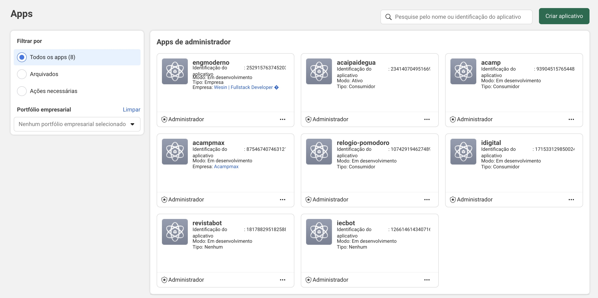
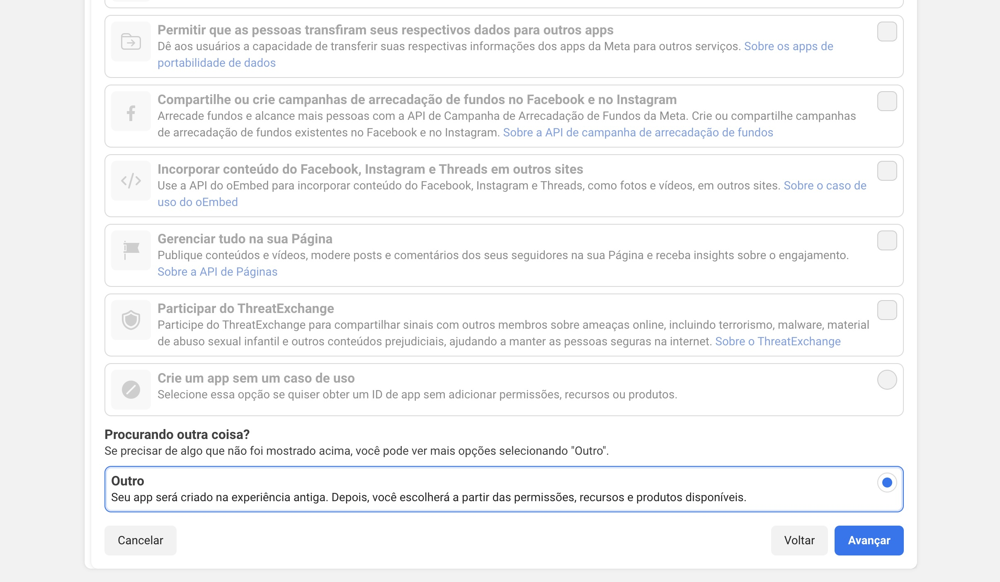
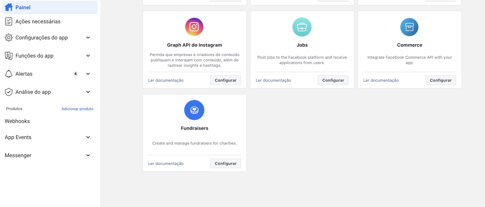
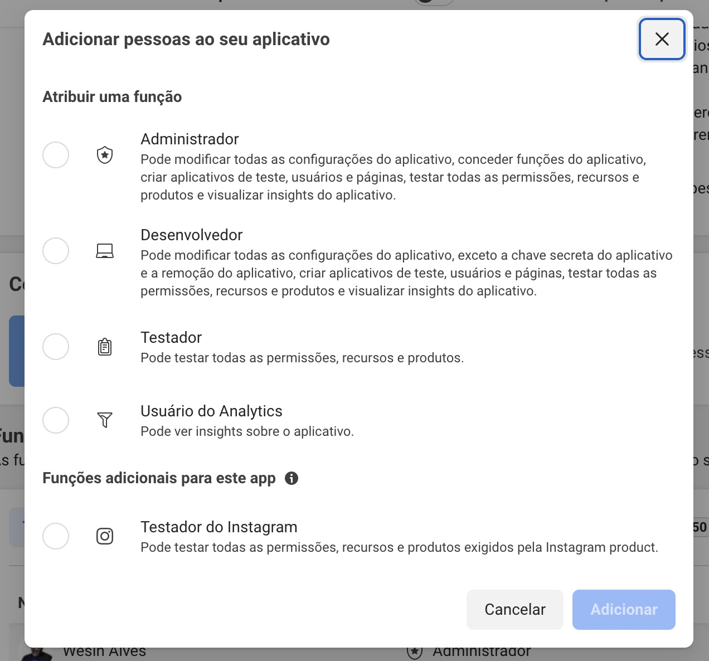
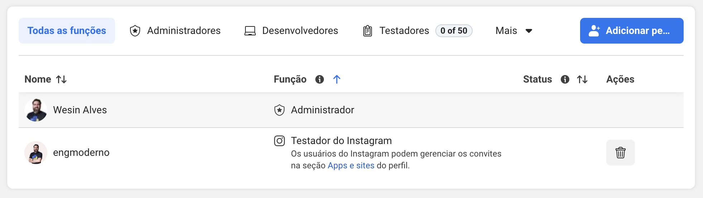
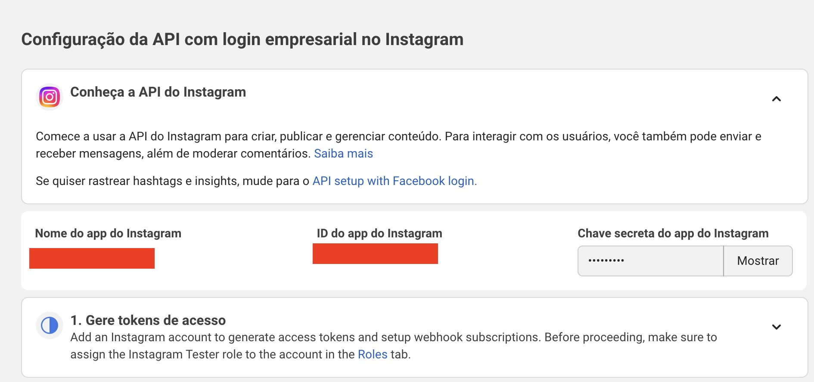
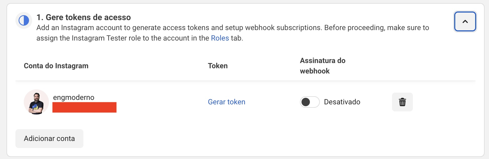

No mundo conectado, as redes sociais se tornaram uma parte essencial da vida cotidiana. Entre as várias plataformas disponíveis, o Instagram se destaca como uma das mais populares para compartilhamento de fotos e vídeos. 

Você pode inserir posts do Instagram em seu site de forma manual incluindo o código de incorporação fornecido pela plataforma. No entanto, para uma integração mais dinâmica e automatizada, a utilização da API do Instagram é a melhor abordagem.

Para desenvolvedores que desejam integrar funcionalidades do Instagram em suas aplicações, a API do Instagram oferece uma maneira poderosa de acessar dados e interagir com a plataforma. Neste artigo, exploraremos como utilizar a API do Instagram para obter posts e outras informações relevantes.

Você pode conferir um exemplo dessa integração na página inicial do [engenheiro moderno](https://engenheiromoderno.com.br). Vale destacar que o Instagram possui duas APIs principais: a API do Instagram Graph e a API do Instagram Basic Display. A escolha entre elas depende das necessidades específicas do seu projeto.
Outro ponto importante é que essas APIs estão sujeitas a políticas de uso e limitações impostas pelo Instagram, portanto, é fundamental revisar a documentação oficial para garantir conformidade. No meu caso por exemplo, tive que criar um novo app no Facebook Developers, pois o app que eu tinha já não estava mais conectando com o Instagram.

Antes de começar, é preciso entender que o Instagram possui duas APIs principais: a API do Instagram Graph e a API do Instagram Basic Display. A escolha entre elas depende das necessidades específicas do seu projeto. A API do Instagram Graph é mais robusta e oferece acesso a dados de contas comerciais e criadores, enquanto a API Básica é mais simples e adequada para acessar mídias de contas pessoais, portanto, neste artigo, focaremos na API Básica do Instagram para obter posts.

Confira abaixo um passo a passo de como obter posts do Instagram via API utilizando a API Básica do Instagram:

### Passo 1: Configurar o aplicativo no Facebook Developers
1. Acesse o [Facebook Developers](https://developers.facebook.com/) e crie uma conta de desenvolvedor, se ainda não tiver uma.
2. Crie um novo aplicativo clicando no botão "Meus Apps" e depois em "Criar App".

3. Selecione o tipo outros na tela de caso de uso e clique em "Avançar". Certifique-se de selecionar Outros, pois as outras opções não permitem o uso da API Básica do Instagram.

4. Selecione o tipo de aplicativo "Negócios" e clique em "Avançar".
5. Preencha os detalhes do aplicativo, como nome, e-mail de contato e clique em "Criar App".
6. Na seção "Adicionar um Produto", encontre "Instagram" e clique em "Configurar".

7. Siga as instruções para configurar a API Básica do Instagram, incluindo a criação de uma conta do Instagram (se não tiver uma) e a vinculação ao aplicativo.
8. Adicione as permissões necessárias, como `instagram_basic` e `pages_show_list`.
9. Complete o processo de revisão, se necessário, para obter acesso completo às permissões.


### Passo 2: Adicionar usuário de testador do Instagram
1. No painel do seu aplicativo, vá para a seção Funções do App.
2. Clique no botão "Adicionar Pessoas" e insira o nome de usuário do Instagram que você deseja adicionar como testador.
3. Selecione a opção "Testador do Instagram" e envie o convite.

4. O usuário do Instagram precisará aceitar o convite em suas configurações de conta do Instagram.


### Passo 3: Gerar token de acesso
1. Vá para a seção "Instagram" e selecione "Configuração da API com login do Instagram".
2. Adicione o usuário de teste que você adicionou anteriormente na guia "Gerar tokens de acesso".
3. Selecione as permissões necessárias e gere o token de acesso.


### Passo 4: Pegar o ID do usuário Testador do Instagram
1. Na mesma seção "Configuração da API com login do Instagram"
2. Verifique o ID do usuário Testador do Instagram que você adicionou anteriormente na guia "Gerar tokens de acesso".


### Passo 5: Obter posts do Instagram
1. Use a seguinte URL para obter os posts do usuário:
   ```
   https://graph.instagram.com/ID_DO_USUARIO/media?fields=id,caption,media_type,media_url,permalink,thumbnail_url,timestamp&access_token=SEU_TOKEN_DE_ACESSO
   ```
2. Substitua `ID_DO_USUARIO` pelo ID do usuário que você obteve no passo anterior e `SEU_TOKEN_DE_ACESSO` pelo token de acesso.
3. A resposta incluirá uma lista de posts com detalhes como legenda, tipo de mídia, URL da mídia, link permanente, URL da miniatura e timestamp.

```js
useEffect(() => {
    fetch(`https://graph.instagram.com/${process.env.GATSBY_APP_ID}/media?fields=id,caption,media_type,media_url,permalink&access_token=${process.env.GATSBY_ACCESS_TOKEN}&limit=6`)
      .then((response) => response.json())
      .then((data) => setPosts(data.data));
  }, []);
```
O trecho de código acima é um exemplo de como buscar os posts do Instagram usando React. Ele utiliza o hook `useEffect` para fazer a requisição à API do Instagram quando o componente é montado. Os dados dos posts são armazenados no estado `posts` usando o hook `useState`. Nota que estou usando variáveis de ambiente para armazenar o ID do aplicativo e o token de acesso, o que é uma prática recomendada para manter essas informações seguras.

### Passo 6: Exibir posts em seu site
1. Com os dados dos posts em mãos, você pode criar uma interface em seu site para exibir as imagens, legendas e links.
2. Utilize HTML, CSS e JavaScript para formatar e estilizar a apresentação dos posts conforme desejado. Aqui está um exemplo simples de como utilizei a api para exibir os posts usando o framework Gatsby no meu blog:

```js
<Container maxWidth="md" component="main">
        <Typography
          component="h1"
          variant="h4"          
          align="center"
          color="text.primary"
          mt={0}
          gutterBottom
          >
          Instagram
          </Typography>
          <Grid container spacing={5} alignItems="flex-end">
          {posts && posts.map((post) => (
              // Enterprise card is full width at sm breakpoint
              <Grid
              item
              key={post.id}
              xs={12}
              sm={post.id === 'Enterprise' ? 12 : 6}
              md={4}
              >
              <Card >
                <CardMedia sx={{backgroundColor:'common.black'}}>
                    {post.media_type === 'VIDEO'
                        ? <InstagramEmbed url={post.media_url} />
                        : 
                    }
                </CardMedia>
                    
                <CardContent>
                    <Typography variant="body2" color="text.secondary">
                        {post.caption.substring(0, 50)}...
                    </Typography>
                </CardContent>
                <CardActions>
                    <Button size="small" variant="contained" fullWidth 
                    href={post.permalink} target="_blank">Acessar</Button>                    
                </CardActions>
                </Card>
              </Grid>
          ))}
          </Grid>
          
      </Container>
   
```
O código acima utiliza componentes do Material-UI para criar um layout responsivo que exibe os posts do Instagram em cartões. Cada cartão inclui a mídia (imagem ou vídeo), uma parte da legenda e um botão que leva ao post original no Instagram. Note que esse é apenas um exemplo básico e você pode personalizar o design e a funcionalidade conforme suas necessidades.

### Considerações Finais
Integrar posts do Instagram em seu site via API pode enriquecer a experiência do usuário e aumentar o engajamento. No entanto, é importante estar ciente das políticas de uso do Instagram e garantir que você esteja em conformidade com os termos de serviço da plataforma. Além disso, mantenha seu token de acesso seguro e renove-o conforme necessário para evitar interrupções no acesso aos dados.
Com esses passos, você estará apto a obter e exibir posts do Instagram em seu site de forma dinâmica e automatizada. Aproveite as possibilidades que a API do Instagram oferece para criar experiências envolventes para seus usuários!

