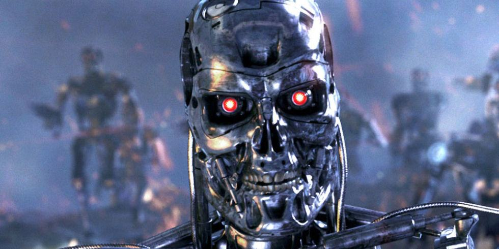

# Introdução
 
Já não é de hoje que a Inteligência Artificial (IA) é colocada como a grande causadora de eventos catastróficos que ameaçam toda a raça humana. Um dos exemplos mais populares é a SKYNET no filme Exterminador do Futuro. Outro grande exemplo está no filme Matrix, onde as máquinas liquefazem os humanos para recarregarem suas baterias.

A despeito do apocalipse causado por IA nos filmes de Hollywood ser apenas ficção científica, o executivo da AWS, Matt Garman, tem feito profecias de que a área de programação estaria com os dias contados por conta do advento das IA's generativas. Será que a IA generativa irá provocar o apocalipse dos programadores? Vejamos algumas dessas profecias.

 > “Se você avançar 24 meses a partir de agora, ou algum período de tempo — não posso prever exatamente onde será — é possível que a maioria dos desenvolvedores não esteja codificando”, disse Garman, de acordo com o áudio vazado e compartilhado pelo portal Business Insider.

 > “A codificação é como a linguagem que falamos com os computadores. Não é necessariamente a habilidade em si”, ele explicou. “A habilidade em si é como, como eu inovo? Como eu construo algo que seja interessante para meus usuários finais usarem?”

 > “Significa apenas que cada um de nós tem que ficar mais em sintonia com o que nossos clientes precisam e qual é o objetivo final que vamos tentar construir, porque isso será cada vez mais o que o trabalho é, em vez de sentar e realmente escrever código”, continuou o executivo.

 > “Ser um desenvolvedor em 2025 pode ser diferente do que era ser um desenvolvedor em 2020″, ele acrescentou.

# Impacto da IA no mercado de trabalho
A produtividade da IA generativa para produzir código é fantástica, mas não é apenas no trabalho de engenheiros de software que a IA vem impactando. Várias outras profissões tem sido impactadas e ameaçadas pelo advento dos modelos de linguagem de larga escala.

No setor industrial, por exemplo, máquinas inteligentes e sistemas automatizados estão substituindo tarefas operacionais repetitivas, resultando em uma demanda reduzida por mão de obra humana nesses processos. 

À medida que modelos de IA mais avançados vão surgindo, tarefas clássicas desempenhadas por operadores de máquinas e montadores podem ser totalmente automatizadas. Isso levanta um alerta sobre a requalificação da força de trabalho, destacando a necessidade de adaptação constante às demandas tecnológicas.

Na área da saúde, a inteligência artificial está auxiliando a abordagem diagnóstica, analisando grandes conjuntos de dados médicos em tempo recorde. Isso facilita a vida de profissionais da saúde no diagnóstico de doenças de forma precoce e na personalização de tratamentos. Apesar dos avanços, a implementação ética e segura dos modelos de IA na área da saúde é fundamental para garantir a privacidade do paciente.

No setor financeiro, o uso da inteligência artificial está provocando transformações significativas. Tarefas como análise de dados, tomada de decisões de investimentos são facilmente delegadas para uma agente de IA.

Em profissões criativas, a IA generativa também vem causando certo desconforto. A IA já é capaz de produzir música, imagens e vídeos, logo, artistas vem refletindo sobre o papel de IA no seu processo criativo.

# O mercado da IA generativa

Vamos supor que a IA provocou a demissão em massa dos programadores com a promessa de que qualquer um iria poder usá-la para criar sistemas. Você já parou pra pensar quem vai fazer o deploy desses sistemas, quem vai dar manutenção, quem vai corrigir os bugs? Quem vai melhorar o desempenho, quem vai planejar a arquitetura do sistema? 

Uma questão para refletir, será que as empresas provedoras de IA tem interesse em produzir modelos cada vez mais avançados a ponto de que realmente consiga substituir o papel de programadores com 100% de confiança, considerando que o maior mercado dessas empresas são os próprios programadores?

Outro questionamento, será que programadores vão continuar adquirindo um produto que poderá acabar com sua profissão?

# Apocalipse dos programadores

Diante desse cenário, não há dúvida que a IA irá impactar a forma como os desenvolvedores de software trabalham. Para alguns, esse impacto pode sim ser considerado um apocalipse.

Se você apenas copia e cola código dos outros, ou copia e cola código gerado pela IA, se você não atualiza seus conhecimentos, está parado no tempo, não quero vender sustos mas sua carreira pode sofrer um apocalipse.

Porém, se você é um profissional que se preocupa com o código que está sendo escrito, pensa sempre em refatoração de código, ou se pode otimizar o tempo de execução de um algoritmo, ou se aquele padrão de projeto é adequado, se a estrutura de dados que você está usando é a mais eficiente, não se preocupe pois você tem um poder de barganha muito grande em mãos.

Desenvolver um software envolve não apenas tarefas repetitivas mas também análise de requisitos, gerenciamento de equipes, comunicação eficaz, relacionamento com área de negócio e outras atividades difíceis de serem substituídas por uma IA ou por pessoas leigas.

> Programar é arte, programar é vida, programar é belo, programar é paixão. É o desejo de criar algo novo, de começar de novo, é recomeço, é a solução.

Programar te ajuda a pensar, logo, programar estimula seu raciocínio, ativa as sinapses nervosas entre seus neurônios e oxigena seu cérebro. Programar é como se fosse musculação para o cérebro, é como resolver um exercício de cálculo ou resolver um cubo mágico.

> "Se você usa IA generativa para programar, um dia seu cérebro vai atrofiar"
  
# Conclusão

Nesse artigo você conferiu uma análise sobre o impacto da utilização da IA generativa na profissão de engenharia de software. Executivos de grandes empresas vem argumentando sobre um possível apocalipse de programação em um futuro próximo como Matt Garman da AWS.

O impacto da IA generativa no mercado de trabalho é real e provavelmente um caminho sem volta, as profissões mais operacionais estão fortemente ameaçadas, porém profissões mais técnicas e criativas talvez sofram apenas transformações e adaptação.

Na engenharia de software, os profissionais que precisam se preocupar com o apocalipse da programação são os profissionais que não se especializam.

Vou deixar nas referências links para livros que vão te ajudar a não temer o apocalipse dos programadores. Em (1) você vai dominar o aprendizado de máquina e conhecer os fundamentos que regem os modelos de linguagem de larga escala. Em (2) e (3) você vai aprender os algoritmos mais poderosos para aprimorar suas habilidades de programação.

# Referências

[(1) Mãos à Obra: Aprendizado de Máquina com Scikit-Learn, Keras & TensorFlow: Conceitos, Ferramentas e Técnicas Para a Construção de Sistemas Inteligentes](https://amzn.to/481eKGv)

[(2) Algoritmos Teoria e Prática](https://amzn.to/3Na6Pgz)

[(3) Entendendo Algoritmos: Um Guia Ilustrado Para Programadores e Outros Curiosos](https://amzn.to/3TUUT64)