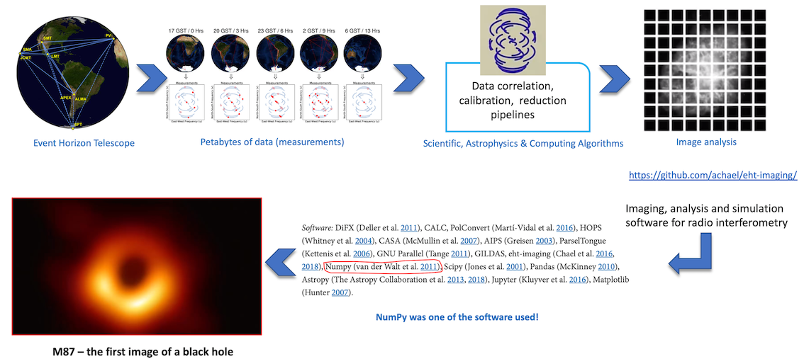
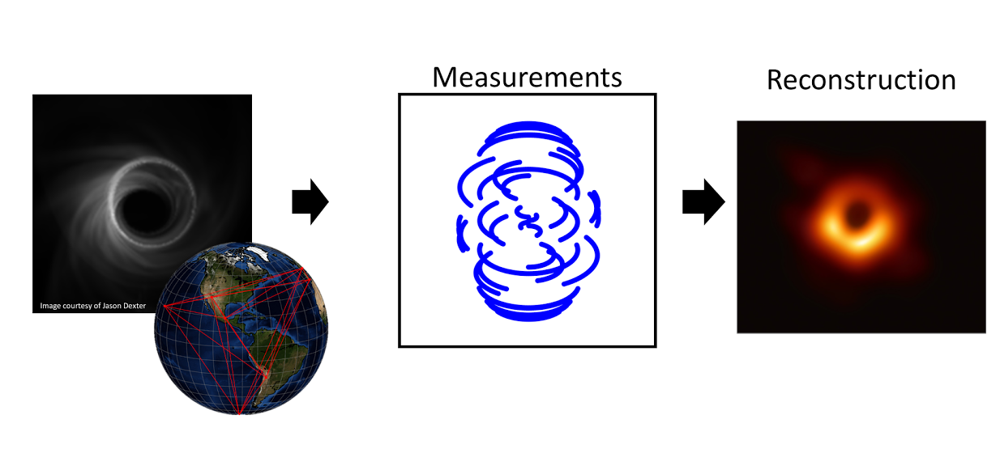

No filme "Interestelar" lançado em 2014, um buraco negro fictício chamado Gargantua 
tem um grande destaque na trama.
Nele, Matthew McConaughey e Anne Hathaway interpretam astronautas que 
viajam através de um buraco de minhoca - um túnel que permite viagens 
quase instantâneas entre pontos distantes - para explorar três planetas 
que orbitam Gargântua, 10 bilhões de anos-luz da Terra. Para criar a imagem do 
buraco negro, o diretor Crhistopher Nolan contratou 
a consultoria do físico teórico e ganhador do Nobel de física Kip Thorn.

Apenas cinco anos após o filme, um punhado de grandes descobertas sobre 
buracos negros deram aos físicos novos insights sobre como esses objetos 
massivos se comportam, e inclusive, como eles realmente se parecem. 

Embora os cientistas estejam pesquisando e teorizando buracos negros há décadas, 
esta é a primeira imagem visual de um buraco negro. Esta imagem é o resultado 
de um enorme esforço colaborativo através do EHT.


Neste artigo você irá descobrir:
* O que é um buraco negro
* Qual telescópio foi utilizado
* Como a primeira imagem de um buraco negro foi gerada
* Como fazer uma imulação de um buraco negro

# O que é um buraco negro?
Buraco negro é uma região do espaço-tempo em que o campo gravitacional 
é tão intenso que nada — nenhuma partícula ou radiação eletromagnética 
como a luz — pode escapar. A teoria da relatividade geral prevê que 
uma massa suficientemente compacta pode deformar o espaço-tempo para 
formar um buraco negro.

# Quem é o autor da teoria de buraco negros?
A ideia de um corpo tão massivo que nem a luz poderia escapar foi 
brevemente proposta pelo pioneiro astronômico e clérigo inglês John Michell 
em uma carta publicada em novembro de 1784. Os cálculos simplistas de Michell 
supunham que esse corpo pudesse ter a mesma densidade que o Sol e 
concluíram que esse corpo se formaria quando o diâmetro de uma estrela 
excedesse o do Sol por um fator de 500 e a velocidade de escape da superfície 
excedesse a velocidade usual da luz.

Em 1915, Albert Einstein desenvolveu a teoria da relatividade geral, 
que mostrou que quando uma estrela massiva morre, ela deixa para trás um 
pequeno núcleo remanescente denso. Se a massa do núcleo for mais do que 
cerca de três vezes a massa do Sol, mostraram as equações, a força da 
gravidade supera todas as outras forças e produz um buraco negro. 

# Qual o telescópio utilizado para ver o buraco negro?
Em 10 de abril de 2019, a imagem direta de um buraco negro e 
sua vizinhança foi publicada, após observações feitas pelo 
*Event Horizon Telescope* (EHT) em 2017 do buraco negro supermassivo no centro 
galáctico de Messier 87.

Esse telescópio é um conjunto de oito radiotelescópios 
terrestres que formam um telescópio computacional do tamanho da Terra, 
estudando o universo com sensibilidade e resolução sem precedentes. 
O enorme telescópio virtual, que usa uma técnica chamada interferometria 
de linha de base muito longa (VLBI), tem uma resolução angular de 
20 micro-segundos de arco – o suficiente para ler um jornal em Nova York 
de um café na calçada em Paris!

# Quais os desafios enfrentados para coletar os dados?

O EHT apresenta enormes desafios de processamento de dados, incluindo 
rápidas flutuações de fase atmosférica, grande largura de banda de 
gravação e telescópios amplamente diferentes e geograficamente dispersos.

A cada dia, o EHT gera mais de 350 terabytes de observações, 
armazenadas em discos rígidos cheios de hélio. Reduzir o volume e a 
complexidade de tantos dados é extremamente difícil.

> *Quando o objetivo é ver algo nunca antes visto, como os cientistas podem ter certeza de que a imagem está correta?*

# Como a imagem do buraco negro foi gerada?


A Figura 1 ilustra a metodologia utilizada para tirar foto do buraco negro M87.

O processo para geração da imagem é descrito a seguir.





# Simulação de um buraco negro usando einsteinpy
Dr. Chan explicou que há uma enorme vantagem em usar Python para análise 
porque permite que os cientistas façam seu trabalho mais rapidamente. 
Como essa foi a primeira vez que os cientistas viram esse tipo de dados, 
eles precisavam ser capazes de experimentar coisas diferentes em tempo 
real – e o Python é uma ótima linguagem para essa abordagem exploratória. 
“Muito do nosso trabalho é realmente trabalhar e pensar sobre os dados, 
e o Python nos permite acelerar o processo”, disse ele.

“Acredita-se que o Python sozinho seria muito lento para processar nossos 
volumes de dados. No entanto, com os projetos de código aberto no NumFOCUS, 
conseguimos iterar nossos algoritmos tão rápido que eles nos permitiram 
terminar nosso trabalho em dois anos, o que seria difícil de alcançar se 
usássemos apenas C.”, declara Dr. Chan.

```
import astropy.units as u
from einsteinpy.rays import Shadow
from einsteinpy.plotting import ShadowPlotter
import matplotlib.pyplot as plt

mass = 1 * u.kg
fov = 30 * u.km
# What field of view is the user expecting

shadow = Shadow(mass=mass, fov=fov, n_rays=1000)
obj = ShadowPlotter(shadow=shadow, is_line_plot=True)
obj.plot()
obj.show()

# obj = ShadowPlotter(shadow=shadow, is_line_plot=False)
# obj.plot()
# obj.show()
# plt.show()
```


# Considerações finais
# Referências

[REPOSITÓRIO EHT-IMAGING](https://github.com/achael/eht-imaging)

[First M87 Event Horizon Telescope Results paper](https://arxiv.org/abs/1906.11241)

[First M87 Event Horizon Telescope Results. III. Data Processing and Calibration](https://iopscience.iop.org/article/10.3847/2041-8213/ab0c57/meta)

[Aniversário do filme Interstellar](https://www.businessinsider.com/interstellar-anniversary-learned-about-black-holes-2019-11)

[Numpy](https://numpy.org/case-studies/blackhole-image/)

[Astropy](https://www.astropy.org/)

[Buraco Negro - Wikipedia](https://pt.wikipedia.org/wiki/Buraco_negro)

[Numfocus black hole](https://numfocus.org/case-studies/first-photograph-black-hole)

[Schwarzschild_metric] (https://en.wikipedia.org/wiki/Schwarzschild_metric)

[How to take a picture of a black hole | Katie Bouman](https://www.youtube.com/watch?v=BIvezCVcsYs)