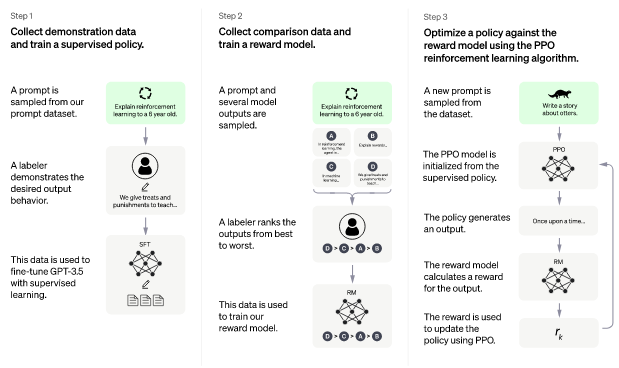

# Introdução
O ChatGPT vem ganhando destaque na mídia nos últimos meses. Algumas matérias
destacam o lado positivo, outras apontam alguns problemas que podem ser causados pelo
uso da tecnologia.

Por exemplo, As escolas públicas de Nova York baniram a utilização
do ChatGPT dos dispositivos e redes dessas escolas alegando que a ferramenta ajuda os alunos a colarem nos testes. 
O porta voz da empresa OpenAI, afirmou que estão desenvolvendo alternativas para mitigar os problemas
enfretados pela escola.

Outro exemplo que ganhou destaque na mídia foi o caso de um juiz na Colômbia
ter utilizado o ChatGPT para redigir uma sentença sobre o direito à saúde
de uma criança autista.

Vale ressaltar que essa ferramenta inteligente alcançou a marca impressionante
de 100 milhões de usuários em apenas dois meses. Em comparação, o TikTok
levou cerca de 9 meses e o Instagram levou cerca de dois anos para atingir a mesma marca.

Diante de toda essa badalação envolvendo o ChatGPT, é importante conhecer
o que é essa ferramenta e como ela pode nos ajudar na nossa vida como programador.

# O que é 
O ChatGPT é uma inteligência artificial conversacional desenvolvida pela
empresa OpenAI no modelo de linguagem GPT-3.5 desenvolvida pela própria
OpenAI.

A empresa OpenAI, fundada por Sam Altima e Elon Musk, afirma que sua nova ferramenta
é um ajuste fino do modelo GPT-3.5 e que foi treinado em supercomputadores da Azure.

O ChatGPT é uma inteligência artificial otimizado para diálogo que utiliza
a técnica de aprendizado por reforço com feedback humano (RLHF) para treinar seu modelo.

Por enquanto, a ferramenta é gratuita com a opção de versão paga (Plus - $20,00) para utilização sem restrições.

# Como funciona o ChatGPT

O modelo de linguagem usado pelo ChatGPT foi treinado pelo método de
aprendizado por reforço com feedback humano (RLHF - Reinforcement Learning from Human Feedback)
em conjunto com um ajuste fino realizado por um método de aprendizado supervisionado.

O ajuste fino da etapa inicial é aplicado ao modelo GPT3.5, no qual os 
supervisores humanos fornecem conversas para ambos os lados, usuários e chatbot.

O modelo de recompensa para a etapa de aprendizado por reforço utiliza
dados coletados para comparação, que contém dois ou mais padrões de respostas
classifacods por sua qualidade. Esses dados são coletados através de conversas
entre os supervisores humanos e o chatbot. O modelo de recompensa é refinado
usando o algoritmo de otimização de política de aproximação (PPO - Proximal Policy Optimization),
um algoritmo desenvolvido pela própria OpenAI.

Em resumo, o modelo utilizado pelo ChatGPT é criado em trẽs etapas: 
a primeira etapa envolve a coleta de exemplos de conversas e treino da política supervisionada;
a segunda etapa contempla a coleta de conversas de comparação e treino do modelo de recompensa;
e a terceira etapa engloba a otimização da política em contraste com o modelo de recompensa
usando o algoritmo PPO. A figura 1 exemplifica cada uma dessas etapas.

# Maneiras pra aproveitar a ferramenta
Existem várias maneiras de aproveitar o ChatGPT para facilitar nossa rotina de trabalho.
A seguir, irei citar alguns exemplos que podem ser usados por pessoas que trabalham
na área da tecnologia da informação.

## 0 - Planejamento de atividades
Começando a contagem por 0, você pode estar pensando em realizar alguma atividade e não sabe por onde começar?
Peça ajuda ao ChatGPT que ele pode te dar uma ideia de como iniciar e conduzir um novo projeto.
Por exemplo, você pretende construir um aplicativo móvel. Então, você pode utilizar a ferramenta para
te ajudar com o planejamento do projeto. Você pode iniciar com pedidos do tipo:
planeje a criação de um aplicativo móvel. Provavelmente, ele irá te fornecer várias etapas de forma bem genérica.
A ideia é ter uma visão geral do planejamento. Além disso, você poderá refinar cada uma das etapas caso tenha ficado alguma dúvida.

## 1 - Assistente em reuniões técnicas
Outra possibilidade de utilização do ChatGPT é como assitente em reuniões técnicas.
Quando estiver participando de alguma reunião técnica, é sempre bom deixar a ferramenta aberta no seu navegador
para consultar algum termo técnico que surgiu na hora da reunião mas você ficou na dúvida. 
O ChatGPT é excelente para encontrar definições de termos técnicos na momento do sufoco.

## 2 - Elaborar textos técnicos
Como modelo de linguagem natural treinado em diversas áreas do conhecimento, 
ele pode elaborar textos técnicos de diversas maneiras, tais como:

* Clarificar conceitos: Com base no seu conhecimento e nas suas necessidades, posso ajudá-lo a entender melhor conceitos técnicos e científicos, explicando-os de forma clara e concisa.
* Revisar e editar textos: Posso ajudá-lo a revisar e editar seus textos técnicos, garantindo que as informações estejam precisas, coerentes e bem estruturadas.
* Elaborar documentos técnicos: Posso ajudá-lo a escrever diversos tipos de documentos técnicos, incluindo manuais de instruções, especificações técnicas, relatórios, artigos e outros.
* Adaptar a linguagem para diferentes públicos: Dependendo do público-alvo do seu texto técnico, posso ajudá-lo a adaptar a linguagem para torná-la mais acessível e compreensível para diferentes níveis de conhecimento.
* Realizar pesquisas: Posso ajudá-lo a realizar pesquisas em diferentes fontes de informação para obter dados técnicos e científicos relevantes para o seu texto.

Em resumo, o ChatGPT pode ajudar você a elaborar textos técnicos de diversas maneiras, trabalhando com você para garantir que suas informações sejam precisas, claras e eficazes.

## 3 - Criar esboço de códigos
Você também pode usar o ChatGPT a criar um esboço de código que você queira implementar.
Nota que é possível também criar o código em si para uma determinada funcionalidade, mas espero que você tenha experiência o suficiente para decidir se aquele código é seguro e confiável.
Por isso, recomendo que você peça para ele te ajudar apenas com o esboço de um código, pois daí você terá subsídios para implementar sua própria versão.
Vale destacar também, que o ChatGPT não conseguirá implementar um sistema inteiro para você. O ideal é você dividir o sistema e ir construindo por partes.

Você pode pedir para ele te ajudar com sugestão de soluções e abordagens 
para criar um esboço de código com base na descrição do seu problema. É possível também utilizá-lo
para definir a sequência lógica de um algoritmo, identificando as etapas necessárias para implementar o código.

Ainda falando sobre códigos, O ChatGPT pode te ajudar a revisar e validar algum trecho de código,
identificando erros de lógica ou sintaxe, e fornecer sugestões para melhorar a eficiência do código nas seguintes linguagens:

* Java
* Python
* C++
* C#
* JavaScript
* PHP
* Ruby
* Swift
* SQL
* HTML/CSS

## 4 - Pesquisar e comparar tecnologias
Outra maneira que o ChatGPT pode ser utilizado é como um assitente de pesquisa
e comparação tecnológicas. Se você está na dúvida de qual tecnologia adotar para seu projeto,
utilize a ferramenta para fornecer subsídios para a tomada de decisão.

Por exemplo, você planeja construir um aplicativo móvel para as plataformas android e ios.
Sua equipe não tem experiência com desenvolvimento para aplicativos móveis. Você precisa
saber qual a melhor abordagem para a criação desse aplicativo. Seria melhor construir de forma nativa ou de forma híbrida.

Você pode descrever esse cenário na ferramenta e ele vai te dar informações que podem te ajudar a decidir o melhor caminho a seguir.
Talvez a primeira resposta pode parecer invasiva, mas se você continuar fornecendo dados para a ferramenta, 
ele pode melhorar a resposta inicial e te ajudar a tomar a decisão mais acertada.

## 5 - Entender trechos de código dos desenvolvedores
Da mesma forma que ele pode ser usado para revisar e avaliar um trecho de código,
O ChatGPT pode ser usado para entender códigos escritos por outros programadores.

Imagina que você é novo na empresa, seu chefe pede para dar manutenção em um sistema legado. Que missão!
Você não conhece o sistema, talvez seja uma linguagem nova para você, e o antigo programador não utilizou boas práticas para escrever o código.
Esse é o cenário perfeito para acionar mais uma vez o amigão dos programadores.

Aí, basta você copiar aquele trexo de código que está em dúvida e colar no prompt do chatbot que ele vai explicar o código para você.
Mas é óbvio que não vai rolar se você copiar o código do sistema inteiro.

## 6 - Checar vulnerabilidades em código
Por fim, mas não menos importante o ChatGPT pode ser usado para encontrar vulnerabilidades em seu código.
Você pode pedir para ele fazer uma análise estática no código que você forncer a ele.

Análise estática de código é uma técnica de análise de software que examina 
o código-fonte de um programa sem a necessidade de executá-lo. 
Ela procura identificar possíveis erros, violações de boas práticas de 
programação, e vulnerabilidades de segurança antes mesmo do código ser compilado ou executado.

Durante a análise estática de código, um programa de computador examina 
o código-fonte em busca de erros comuns de programação, como variáveis 
não inicializadas, uso inadequado de funções de biblioteca, problemas de 
formatação, identação, sintaxe, entre outros. O objetivo é encontrar esses 
erros o mais cedo possível no processo de desenvolvimento, para evitar que 
se tornem problemas mais complexos mais tarde, no processo de teste ou até 
mesmo na produção.

Além disso, o ChatGPT pode ajudar a testar o software através de técnicas de 
testes de penetração, onde eu simulo ataques de hackers para verificar se o 
software é vulnerável a esses tipos de ataques. Eu também posso ajudar a 
realizar revisões de segurança do código, onde eu trabalho em conjunto com um 
profissional de segurança de TI qualificado para examinar o código em busca 
de possíveis vulnerabilidades.

# Referências

[ChatGPT](https://chat.openai.com/chat)

[Juiz usa chatgpt para dar setença](https://g1.globo.com/tecnologia/noticia/2023/02/03/juiz-usa-robo-chatgpt-para-redigir-sentenca-de-caso-de-crianca-autista-na-colombia.ghtml)

[Escolas públicas de Nova York proíbem ChatGPT](https://www.nbcnews.com/tech/tech-news/new-york-city-public-schools-ban-chatgpt-devices-networks-rcna64446)

[ChatGPT - 100 milhões de usuários](https://www.theguardian.com/technology/2023/feb/02/chatgpt-100-million-users-open-ai-fastest-growing-app)