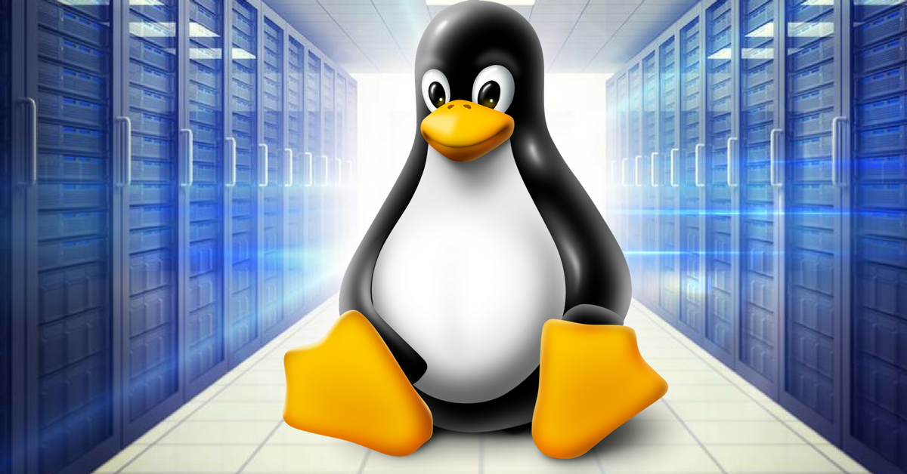
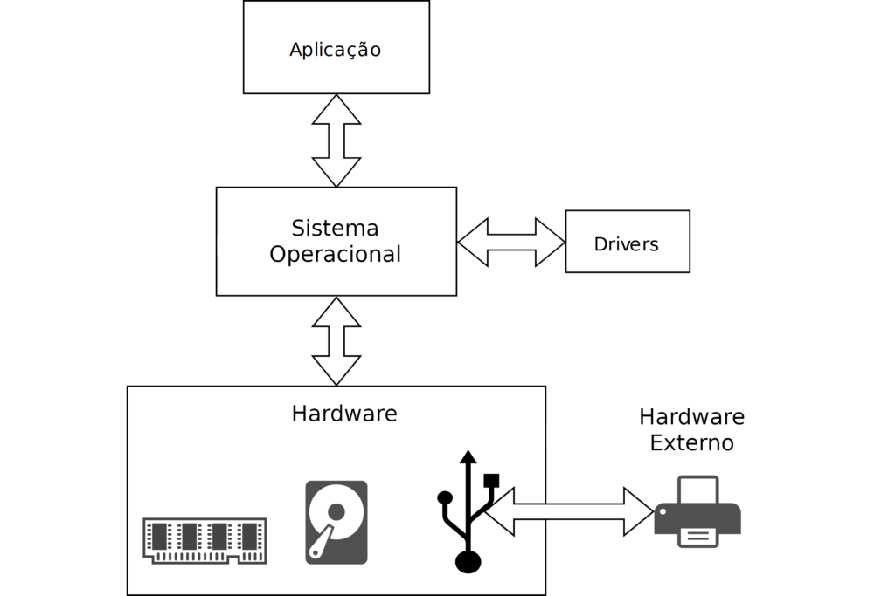
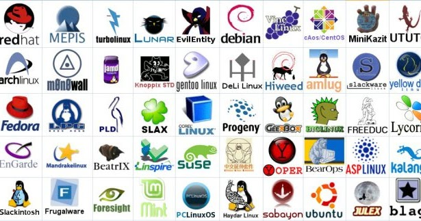

# Introdução
Quem é da área de T.I tem a obrigação de saber o mínimo sobre o sistema Linux. Meu primeiro contato com o Linux foi na faculdade. Geralmente, no mundo acadêmico o sistema do pinguin é bastante disseminado em meio a comunidade. Após concluir o curso, acabei perdendo o contato com o Linux, pois a maioria das empresas por onde passei utilizavam o Windows. Certo dia, depois de anos de formado, me deparei com uma situação constrangedora. Conheci um amigo que usava linux mas ele nem era da área de T.I. Isso mexeu comigo, e pensei que era a hora de voltar a usar esse sistema.

Alguns podem pensar, assim como eu pensei, que é cômodo usar seu velho e bom sistema Windows, mas o fato é que conhecer o básico de linux é essencial em nossa área. Um dos principais motivos para se usar Linux é por questões de segurança e privacidade. O Linux é mais seguro que o Windows por sua estrutura de permissões e sistema de usuários. Linux é menos vulnerável a vírus e malwares, além de ser focado na privacidade, sem rastreamento de dados como em sistemas proprietários.

Outro argumento a favor do Linux é o desempenho. Sistemas Linux são leves e rodam bem até em hardware antigo. Por usar menos recursos do que Windows, garante uma maior velocidade na utilização do sistema. 

Porém, o maior argumento a favor da utilização do Linux é que você pode utilizá-lo de forma gratuita.

Além disso, Linux também é excelente para servidores pelos mesmos motivos citados acima.

Se você já tentou usar Linux mas achou um bicho de 7 cabeças, esse artigo vai te ajudar a superar esse bloqueio pois vou apresentar 5 lições básicas para você começar a usar esse sistema de maneira mais tranquila, sem ficar perdido no meio do caminho.

# 1. O que é um sistema operacional
Imagine seu computador como um carro e você como o motorista. O sistema operacional seria o painel de controle do carro. Ele te permite ligar o carro, controlar a velocidade, mudar as marchas e usar outros recursos, tudo sem você precisar saber como funciona o motor ou os mecanismos internos do veículo.

Em termos mais técnicos, um sistema operacional é um software fundamental que gerencia todos os recursos de hardware do seu computador (como o processador, memória, armazenamento e dispositivos de entrada/saída) e fornece uma interface para que você possa interagir com o computador de forma fácil e intuitiva.

Em outras palavras, sistemas operacionais são conjunto de programas que tornam a utilização de computadores  mais amigáveis para usuários, desenvolvedores e administradores de sistemas e gerenciam os recursos disponíveis.



# 2. Tipos de sistemas operacionais
Podemos classificar os sistemas operacionais de várias formas. Uma delas é pelo kernel (núcleo) do sistema. Nesse caso, podemos dividir em dois grupos: os sistemas baseados em Unix e os baseados no DOS.

Unix é um sistema operacional multitarefa e multiusuário amplamente reconhecido por sua estabilidade, simplicidade e eficiência. Ele foi criado nos anos 1970 por Ken Thompson, Dennis Ritchie e outros pesquisadores nos laboratórios Bell da AT&T. Seu design modular e baseado em ferramentas pequenas e especializadas que podem ser combinadas tornou-se um modelo para muitos sistemas operacionais modernos.

O DOS (sigla para Disk Operating System) é uma família de sistemas operacionais simples e baseados em linha de comando, projetados principalmente para computadores pessoais. Ele foi amplamente utilizado nas décadas de 1980 e 1990, antes do advento de sistemas operacionais com interfaces gráficas, como o Windows.

Outra forma muito comum de classificar os sistemas operacionais é em relação às licenças de utilização. Existem os sistemas operacionais proprietários (pagos) e os de código fonte aberto (gratuitos). Windows e Macos são exemplos de sistemas proprietários pois possuem empresas detem o direito sobre o código fonte desses sistemas são respectivamente a Microsoft e a Apple. Por outro lado, o sistema Linux e o Android são exemplos de sistemas de código de fonte aberto.


# 3. Distribuições Linux
As distribuições Linux (ou "distros") são diferentes versões do sistema operacional Linux, que combinam o kernel Linux com softwares, ferramentas e interfaces gráficas para atender a diversas necessidades. Como o Linux é open source, qualquer pessoa ou organização pode criar sua própria distribuição, resultando em uma grande variedade de opções para usuários domésticos, empresas, servidores e até dispositivos embarcados.


## O que compõe uma distribuição Linux?
Uma distro Linux geralmente inclui:

* Kernel Linux – O núcleo do sistema operacional, responsável por gerenciar hardware e processos.
* Gerenciador de pacotes – Ferramentas para instalar e atualizar programas (ex: apt, dnf, pacman).
* Ambiente gráfico (opcional) – Interfaces visuais como GNOME, KDE, XFCE, Cinnamon, etc.
* Utilitários básicos – Ferramentas para gerenciar arquivos, redes e configurações.
* Aplicações pré-instaladas – Navegador, editor de texto, suíte de escritório, etc.

## Principais tipos de distribuições Linux
As distribuições podem ser categorizadas por finalidade ou base. Aqui estão algumas das mais conhecidas:

**Baseadas no Debian**
* Debian – Estável, confiável e usado como base para várias outras distros.
* Ubuntu – Popular para iniciantes e empresas, com versões LTS (Long Term Support).
* Linux Mint – Fácil de usar, baseado no Ubuntu, ideal para quem vem do Windows.

**Baseadas no Arch Linux** 
* Arch Linux – Personalizável e para usuários avançados, usa o gerenciador pacman.
* Manjaro – Mais amigável que o Arch, mas mantém a flexibilidade.
* EndeavourOS – Oferece uma experiência próxima ao Arch, mas com uma instalação mais fácil.

**Baseadas no Fedora/Red Hat** 
* Fedora – Inovador, recebe as versões mais recentes de software primeiro.
* Red Hat Enterprise Linux (RHEL) – Voltado para empresas, com suporte pago.
* CentOS Stream – Alternativa gratuita ao RHEL, com atualizações contínuas.

**Outras distros notáveis**
* openSUSE – Oferece versões estáveis e de desenvolvimento.
* Kali Linux – Para segurança cibernética e testes de penetração.
* Alpine Linux – Leve, ideal para servidores e containers (Docker).
* Slackware – Uma das distros mais antigas, voltada para usuários experientes


# 4. Diretórios principais
No Linux, o sistema de arquivos segue uma estrutura hierárquica semelhante a uma "árvore", começando com o diretório raiz (/). Cada diretório tem uma finalidade específica, e entender isso é essencial para navegar e trabalhar no sistema. Aqui estão os principais diretórios no Linux:

1. **/ (Raiz)**
É o topo da hierarquia de arquivos. Todos os outros diretórios e arquivos estão contidos dentro do /. Apenas o superusuário (root) tem total controle sobre ele.

2. **/bin (Binary)**
Contém comandos essenciais do sistema disponíveis para todos os usuários, como ls, cp, mv, cat, etc.
Esses programas são necessários para o funcionamento básico do sistema, mesmo em modo de recuperação.

3. **/sbin (System Binary)**
Armazena comandos do sistema usados principalmente por administradores, como fsck, reboot, ifconfig, etc.
Estes comandos geralmente precisam de privilégios de root.

4. **/usr (User)**
Contém arquivos de software instalados pelo sistema e ferramentas adicionais para usuários. É subdividido em:

- /usr/bin: Programas e comandos adicionais para usuários.
- /usr/sbin: Ferramentas administrativas adicionais.
- /usr/lib: Bibliotecas compartilhadas usadas por programas em /usr/bin e /usr/sbin.
- /usr/share: Arquivos compartilhados como documentação e ícones.

5. **/home**
Diretório que contém os arquivos pessoais dos usuários. Cada usuário tem uma pasta dentro de /home (ex: /home/maria ou /home/joao).
É onde estão documentos, configurações pessoais, downloads, etc.

6. **/root**
Diretório home do usuário administrador (root). É separado de /home para maior segurança.
Apenas o superusuário pode acessar este diretório.

7. **/etc**
Contém arquivos de configuração do sistema e programas. Exemplos:
/etc/fstab: Configuração de sistemas de arquivos montados.
/etc/hosts: Configuração de nomes de host.

8. **/var (Variable)**
Contém arquivos que mudam constantemente, como:
Logs do sistema: /var/log/.
Arquivos temporários de spool (impressoras, emails): /var/spool/.

9. **/tmp (Temporary)**
Diretório para arquivos temporários criados por programas ou usuários.
Seu conteúdo geralmente é apagado automaticamente após reiniciar o sistema.

10. **/dev (Device)**
Contém arquivos que representam dispositivos de hardware, como discos, USBs, impressoras, etc.
Exemplos: /dev/sda (disco rígido), /dev/tty (terminais).

11. **/proc**
Diretório virtual que fornece informações sobre processos em execução e o estado do sistema.
Exemplos: /proc/cpuinfo (informações sobre o processador), /proc/meminfo (uso da memória).

12. **/sys**
Semelhante a /proc, armazena informações sobre dispositivos e componentes do kernel. É usado para comunicação entre o kernel e o sistema.

13. **/lib**
Contém bibliotecas essenciais usadas pelos programas em /bin e /sbin.
Inclui também módulos do kernel em /lib/modules.

4. **/opt**
Diretório opcional usado para instalar software adicional que não faz parte do sistema padrão.
Exemplo: Aplicações comerciais ou personalizadas

15. **/mnt e /media**
/mnt: Ponto de montagem temporário para sistemas de arquivos externos (ex.: discos externos, partições).
/media: Ponto de montagem usado principalmente para dispositivos removíveis, como pen drives e DVDs.

16. **/boot**
Contém arquivos necessários para inicializar o sistema, como o kernel Linux (vmlinuz) e o carregador de inicialização (GRUB, LILO).

17. **/srv (Service)**
Usado para armazenar dados específicos de servidores, como arquivos de sites ou FTP.

# 5. Comandos básicos

## 1. cp (Copiar arquivos e diretórios)

**Sintaxe**
```
cp [opções] origem destino
```

**Exemplos**
* Copiar um arquivo
```
cp arquivo.txt /home/usuario/
```

* Copiar um diretório inteiro (-r para recursivo)
```
cp arquivo.txt /home/usuario/
```

* Perguntar antes de sobreescrever
```
cp -i arquivo.txt destino/
```

## 2. cd (Mudar diretório)
O comando cd permite navegar pelos diretórios.

**Sintaxe**
```
cd [diretório]
```
**Exemplos**
* Ir para um diretório específico:
```
cd /home/usuario/Documentos
```
* Voltar um nível:
```
cd ..
```
* Voltar para o diretório pessoal (~ representa o home do usuário)
```
cd ~
``` 

## 3. mv (Mover ou renomear arquivos e diretórios)
O comando mv move arquivos/diretórios ou os renomeia.

**Sintaxe**
```
mv [opções] origem destino
```

**Exemplos**
* Mover um arquivo para outro diretório
```
mv arquivo.txt /home/usuario/Documentos/
```
* Renomear um arquivo:
```
mv antigo.txt novo.txt
```
* Mover um diretório inteiro
```
mv pasta1 /home/usuario/
```

## 4. pwd (Mostrar diretório atual)
O comando pwd exibe o caminho completo do diretório atual.

**Exemplo**
```
pwd
```
**Saída esperada**
```
/home/usuario/Documentos
```

## 5. ls (Listar arquivos e diretórios)
O comando ls exibe o conteúdo de um diretório.

**Sintaxe**
```
ls [opções] [caminho]
```

**Exemplos**
* Listar arquivos no diretório atual:
```
ls
```
* Listar arquivos com detalhes (-l mostra permissões, dono, tamanho e data):
```
ls -l
```
* Listar arquivos ocultos (-a mostra arquivos que começam com .):
``` 
ls -a
```
* Listar arquivos ordenados por data de modificação (-lt):
```
ls -lt
```
* Listar arquivos de um diretório específico:
```
ls /home/usuario/Downloads
```


## 6. chown (Alterar dono e grupo de um arquivo ou diretório)
O comando chown permite mudar o proprietário e o grupo de arquivos ou diretórios.

**Sintaxe**
```
chown [opções] novo_dono:novo_grupo arquivo
```

**Exemplos**
* Mudar o dono de um arquivo para joao:
```
chown joao arquivo.txt
```
* Mudar o dono e o grupo (: separa dono e grupo):
```
chown joao:usuarios arquivo.txt
```
* Mudar o dono de uma pasta e todo seu conteúdo (-R para recursivo):
```
chown -R joao:usuarios /home/joao/pasta
```

## 7. chmod (Alterar permissões de arquivos e diretórios)
O comando chmod modifica as permissões de leitura (r), escrita (w) e execução (x) de arquivos e diretórios. Esse comando é o mais complexo dessa lista.

**Sintaxe**
```
chmod [opções] modo arquivo
```

**Métodos de alteração**
1. Modo Simbólico (usando letras):

* u (usuário/dono)
* g (grupo)
* o (outros)
* a (todos)
* \+ (adicionar permissão)
* \- (remover permissão)
* = (definir exatamente estas permissões)

2. Modo Numérico (usando valores de permissão):

* 4 = leitura (r)
* 2 = escrita (w)
* 1 = execução (x)

As permissões são somadas para formar valores específicos:

- 7 (4+2+1) → Leitura, escrita e execução (rwx)
- 6 (4+2) → Leitura e escrita (rw-)
- 5 (4+1) → Leitura e execução (r-x)


**Exemplos**
* Permitir que o dono do arquivo tenha leitura, escrita e execução (u=rwx):
```
chmod u+rwx arquivo.txt
```
* Remover permissão de escrita do grupo:
```
chmod g-w arquivo.txt
```
* Definir permissões rwx para dono, r para grupo, r para outros (755 em numérico):
```
chmod 755 script.sh
```
* Tornar um arquivo apenas legível para todos (444):
```
chmod 444 documento.txt
```
* Tornar um script executável para todos (+x):
```
chmod +x script.sh
```
* Alterar permissões recursivamente (-R):
```
chmod -R 755 /home/usuario/meus_scripts
```

## 8. rm (remove)
O comando rm é usado para excluir arquivos e diretórios no Linux. Ele não envia os arquivos para a lixeira, então a remoção é permanente.

**Sintaxe**
```
rm [opções] arquivo_ou_diretorio
```
**Exemplos**
* Remover um único arquivo
```
rm arquivo.txt
```
* Remover vários arquivos de uma vez
```
rm arquivo1.txt arquivo2.txt arquivo3.txt
```
* Remover um diretório vazio
```
rmdir pasta
```
ou
```
rm -d pasta
```
* Remover um diretório e seu conteúdo
```
rm -r pasta
```

## 9. sudo 
O comando sudo (Super User DO) permite que um usuário comum execute comandos com privilégios de administrador (root) temporariamente. Isso é útil para realizar tarefas que exigem permissões especiais, como instalar pacotes, modificar arquivos de sistema ou gerenciar usuários.

**Sintaxe**
```
sudo [opções] comando
```
**Exemplo**
```
sudo apt update
```
Isso atualiza a lista de pacotes do sistema (necessário para instalar atualizações).


Esses comandos são essenciais para trabalhar no Linux. Aqui está um resumo rápido:

<table border="1">
  <thead>
    <tr>
      <th>Comando</th>
      <th>Função</th>
    </tr>
  </thead>
  <tbody>
    <tr>
      <td><code>cp</code></td>
      <td>Copia arquivos/diretórios</td>
    </tr>
    <tr>
      <td><code>cd</code></td>
      <td>Navega entre diretórios</td>
    </tr>
    <tr>
      <td><code>mv</code></td>
      <td>Move ou renomeia arquivos/diretórios</td>
    </tr>
    <tr>
      <td><code>pwd</code></td>
      <td>Exibe o diretório atual</td>
    </tr>
    <tr>
      <td><code>ls</code></td>
      <td>Lista arquivos/diretórios</td>
    </tr>
    <tr>
      <td><code>chown</code></td>
      <td>Altera dono e grupo de arquivos/diretórios</td>
    </tr>
    <tr>
      <td><code>chmod</code></td>
      <td>Modifica permissões de arquivos/diretórios</td>
    </tr>
    <tr>
      <td><code>rm</code></td>
      <td>Remove um arquivo ou diretório</td>
    </tr>
    <tr>
      <td><code>sudo</code></td>
      <td>Concede privilério de administrador a um usuário temporariamente</td>
    </tr>
  </tbody>
  
</table>


# Conclusão
Nesse artigo você viu que não é preciso ter medo de usar o sistema operacional Linux. Além de entender como um sistema operacional funciona e conhecer os tipos de sistemas, você compreendeu que o Linux é uma família de sistemas de código fonte aberto com várias distribuições. Você também conferiu a estrutura básica de diretórios de um sistema baseado em Linux, bem como os comandos mais utilizados em linha de comando.

# Referênciass

[Tabenbaum, A et al. Sistemas operacionais modernos. Bookman, 5ª edição. 2024](https://amzn.to/4aEOanK)