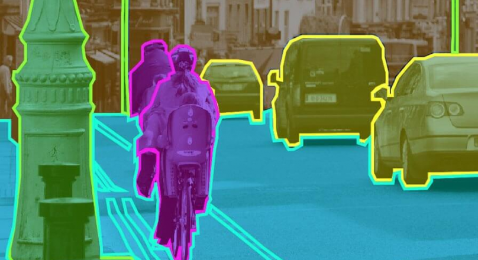

O aprendizado de máquina (Machine Learning) é uma área empolgante da inteligência artificial que permite
aos computadores aprenderem com os dados e fazerem previsões ou decisões sem serem explicitamente programados. Se você está começando sua jornada em Machine Learning, aqui estão cinco projetos simples que você pode tentar para ganhar experiência prática.

## 1) Previsão de emissões de carbono (Regressão simples)
Objetivo: Prever as emissões de carbono com base em fatores como consumo, tipo de combustível e eficiência do veículo.

Ferramentas: Python, Scikit-learn, Pandas, matplotlib

Descrição: Use o conjunto de dados [FuelConsumption](https://github.com/wesinalves/projetos-ml-para-iniciantes/blob/main/datasets/FuelConsumption.csv) que contem informações sobre características de veículos e seu consumo de combustível. Treine um modelo de regressão linear simples para prever as emissões de CO2 com base no consumo de combustível.

Tarefas a serem executadas nesse projeto:
* Carregamento dos dados
* Análise exploratória dos dados
* Pré-processamento dos dados (tratamento de valores ausentes, codificação de variáveis categóricas)
* Gráfico de espalhamento (scatter plot)
* Divisão dos dados em conjuntos de treinamento e teste
* Treinamento do modelo de regressão linear (LR, Lasso, Ridge)
* Avaliação do modelo usando métricas como RMSE (Root Mean Squared Error, MSE)

## Previsão de emissões de carbono (Regressão múltipla)
Objetivo: Melhorar a precisão da previsão de emissões de carbono considerando múltiplos fatores.

Ferramentas: Python, Scikit-learn, Pandas, matplotlib

Descrição: Expanda o projeto anterior para incluir mais variáveis: tamanho do motor, quantidade de cilindros e tipo de combustível. Use regressão múltipla para capturar a influência combinada dessas variáveis.

Tarefas a serem executadas nesse projeto:
* Carregamento dos dados
* Análise exploratória dos dados
* Pré-processamento dos dados (tratamento de valores ausentes, codificação de variáveis categóricas)
* Gráfico de espalhamento (scatter plot)
* Divisão dos dados em conjuntos de treinamento e teste
* Treinamento do modelo de regressão linear (Árvore de Decisão)
* Ajuste de hiperparâmetros (Grid Search)
* Avaliação do modelo usando métricas como RMSE (Root Mean Squared Error, MSE)
* Salve o modelo treinado em um diretório específico

## Classificação de espécies de plantas
Objetivo: Classificar diferentes espécies de plantas com base em suas características morfológicas.

Ferramentas: Python, Scikit-learn, Pandas, matplotlib

Descrição: Utilize um conjunto de dados de plantas que contenha informações como comprimento e largura das folhas. Treine um modelo de classificação, como K-Nearest Neighbors (KNN) ou Decision Trees, para identificar a espécie da planta com base nessas características.

Tarefas a serem executadas nesse projeto:
* Carregamento dos dados
* Análise exploratória dos dados
* Pré-processamento dos dados (tratamento de valores ausentes, codificação de variáveis categóricas)
* Gráfico de espalhamento (scatter plot)
* Divisão dos dados em conjuntos de treinamento e teste
* Treinamento do modelo de classificação (Regressão logística, SVM, Random Forest)
* Ajuste de hiperparâmetros (Grid Search)
* Avaliação do modelo usando métricas como RMSE (acurácia, matriz de confusão)
* Salve o modelo treinado em um diretório específico

# Classificação de digitos manuscritos
Objetivo: Reconhecer dígitos manuscritos a partir de imagens.

Ferramentas: Python, TensorFlow/Keras, NumPy

Descrição: Use o conjunto de dados MNIST, que contém imagens de dígitos manuscritos. Treine uma rede neural simples para classificar as imagens em dígitos de 0 a 9.

Tarefas a serem executadas nesse projeto:
* Carregamento dos dados
* Análise exploratória dos dados
* Pré-processamento dos dados (tratamento de valores ausentes, codificação de variáveis categóricas)
* Gráfico de espalhamento (scatter plot)
* Divisão dos dados em conjuntos de treinamento e teste
* Treinamento do modelo de classificação (Redes neurais artificiais)
* Avaliação do modelo usando métricas como RMSE (F1, precisão, revocação, matriz de confusão)

## Segmentação de imagens
Objetivo: Segmentar diferentes objetos em uma imagem.

Ferramentas: Python, OpenCV, TensorFlow/Keras

Descrição: Utilize um conjunto de dados de imagens com anotações de segmentação. Treine um modelo de segmentação, como U-Net, para identificar e separar diferentes objetos dentro das imagens.

Tarefas a serem executadas nesse projeto:
* Carregamento dos dados
* Análise exploratória dos dados
* Pré-processamento dos dados (tratamento de valores ausentes, codificação de variáveis categóricas)
* Gráfico de espalhamento (scatter plot)
* Divisão dos dados em conjuntos de treinamento e teste
* Treinamento do modelo de classificação (Kmeans)

## Referências
- [Base de dados](https://github.com/wesinalves/projetos-ml-para-iniciantes/tree/main/datasets)
- [Documentação do Scikit-learn](https://scikit-learn.org/stable/documentation.html)
- [Documentação do Pandas](https://pandas.pydata.org/pandas-docs/stable/documentation.html)
- [Documentação do Matplotlib](https://matplotlib.org/stable/contents.html)
- [Documentação do OpenCV](https://docs.opencv.org/master/)
- [Hands on machine learning](https://amzn.to/42nJXlz)
