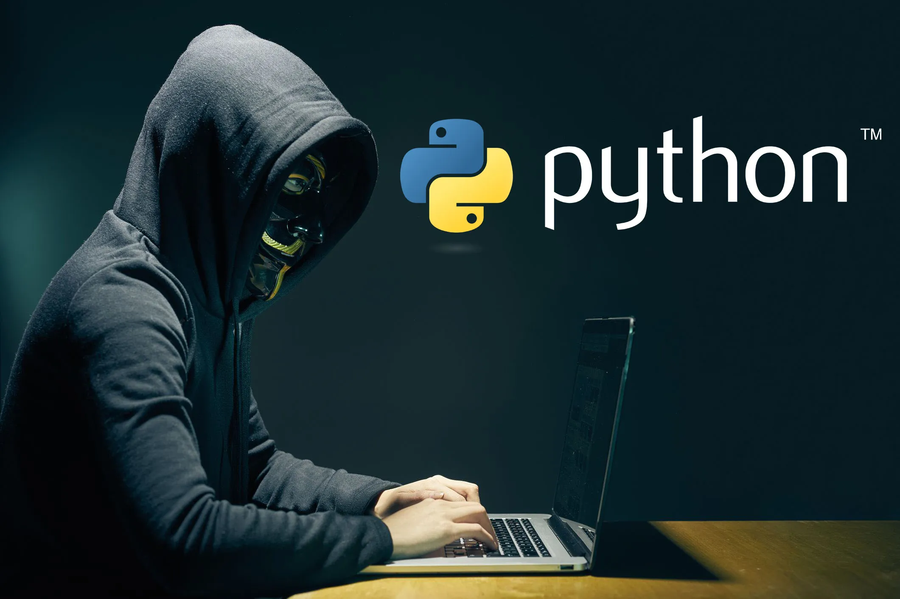

A flexibilidade do Python no desenvolvimento web, análise de dados e projetos de aprendizado de máquina tornou-o uma das linguagens mais populares do mundo, mas com sua flexibilidade vêm muitas implicações de segurança. Então, vejamos sete práticas que podem ajudar você a manter suas aplicações mais seguras.

# Nunca confie na entrada de usuário
A validação de entrada e a higienização de dados são aspectos fundamentais da codificação segura. É importante validar todos os dados recebidos em relação aos formatos esperados e higienizá-los, pois isso pode reduzir bastante os riscos representados por injeção de SQL e ataques de script entre sites (XSS). O processamento de dados não higienizados pode ter sérias implicações para a segurança da infraestrutura e dos dados do cliente. Também pode ser usado para fornecer vetores de ataque para explorações, por exemplo, exfiltração de dados, falsificações de solicitações e ataques baseados em injeção. Para uma higienização e validação robustas, considere bibliotecas como Pydantic, que podem ajudá-lo a confirmar se todos os dados recebidos são os esperados. Usando o Pydantic, que adota uma abordagem de falha antecipada, podemos interromper a propagação de dados antes que eles se tornem um problema.

# Usar ferramentas e bibliotecas seguras
Aproveite o ecossistema de bibliotecas e ferramentas do Python projetadas para aumentar a segurança. Aqui estão alguns exemplos de tais ferramentas:
- Gerenciamento de Dependências: Use *pip-audit* para verificar vulnerabilidades em dependências.
- Autenticação: implemente bibliotecas como *Flask-Login* para gerenciamento seguro de sessões.
- Criptografia: Proteja dados confidenciais usando a biblioteca de *criptography* para criptografia e *bcrypt* para hash.
- Análise de código: use ferramentas como o *bandit* para verificar automaticamente sua base de código em busca de problemas de segurança.
- Hipótese: Utilize bibliotecas de teste como *hypothesis* para ajudar a eliminar casos extremos e comportamentos estranhos. Ao integrar esses recursos ao seu fluxo de trabalho de desenvolvimento, você pode aumentar significativamente a segurança do seu aplicativo.

# Manter os pacotes sempre atualizados
Atualize regularmente o tempo de execução e as bibliotecas do Python para corrigir vulnerabilidades e manter a segurança do aplicativo. Use ferramentas modernas de gerenciamento de dependências, como Poetry, para gerenciar e atualizar dependências com eficiência.
## Usando poetry
Comece usando *poetry* por seu forte gerenciamento de dependências e recursos de empacotamento. *Poetry* possui uma ferramenta integrada para rastrear e atualizar dependências de pacotes. Para verificar dependências desatualizadas em seu projeto, use *poetry show --outdated*. Este comando exibe todas as dependências que possuem versões mais recentes. Para atualizar um pacote específico, use *poetry update 'nome do pacote'* ou simplesmente *poetry update* para atualizar todas as dependências desatualizadas. *Poetry* garante que as atualizações sigam as restrições de versão semântica em seu arquivo pyproject.toml, preservando a compatibilidade e minimizando o risco de introdução de alterações significativas.
## Usando pip
Em ambientes sem *poetry*, o *Pip* é uma ferramenta útil para atualização de pacotes. Use *pip list --outdated* para encontrar pacotes desatualizados. Para atualizar um pacote, use *pip install --upgrade 'package-name'* ou aplique *pip install --upgrade* para atualizar vários pacotes. No entanto, para melhor resolução de dependências e recursos de bloqueio, a biblioteca *poetry* é a opção preferida.

Seja cauteloso com as principais atualizações de versão. Eles podem introduzir alterações significativas. Teste seu aplicativo minuciosamente após as atualizações para garantir que todas as funcionalidades funcionem conforme o esperado. Esta fase de testes é crucial para identificar quaisquer incompatibilidades ou problemas introduzidos pelas dependências atualizadas. Aborde-os imediatamente para manter a estabilidade e a segurança.

# Implemente o tratamento de erros e o registro de logs com sabedoria
Ao criar seus sistemas de tratamento e registro de erros, é muito importante pensar em evitar qualquer vazamento acidental de informações. É uma boa ideia evitar mostrar rastreamentos de pilha ou quaisquer dados confidenciais aos usuários. Ao usar o módulo de registro ou criar exceções, certifique-se de que as informações confidenciais foram limpas. Houve alguns vazamentos importantes em que senhas de usuários ou informações bancárias foram expostas na forma de logs do sistema.

Uma pequena dica: defina *DEBUG = False* na produção, ter mensagens detalhadas durante o desenvolvimento é realmente útil. Mas lembre-se de desligá-lo na produção porque você não quer vazar informações sobre seu ambiente, bibliotecas e assim por diante.

# Aderir ao princípio de menor privilégio
É fundamental garantir que seu aplicativo Python funcione bem com bancos de dados, sistemas de arquivos e serviços externos. Você deve sempre aderir ao princípio do menor privilégio, o que significa conceder apenas as permissões necessárias para o trabalho, para que o impacto de uma violação de segurança seja minimizado. Isso significa que você não deve expor mais do que o necessário, não apenas para outras partes do seu sistema, mas também para os seus clientes. É melhor traçar linhas claras entre as diferentes partes do seu sistema e, se houver mais acoplamento, considere usar um mediador para controlar o fluxo de dados entre essas seções.

# Usar protocolo Https para transmissão de dados
Usar HTTPS em vez de HTTP é uma boa ideia quando se trata de transmitir dados com segurança entre seu aplicativo e seus usuários. Este pequeno mas crucial passo pode proteger eficazmente contra possíveis ataques e garantir a máxima proteção de informações cruciais, como credenciais de login e dados pessoais. Considere também criptografar a comunicação entre os serviços. Portanto, fica mais difícil para os hackers detectarem o tráfego.

Ferramentas como *Let’s Encrypt*, que oferece certificados SSL/TLS gratuitos e permite o uso consistente de HTTPS em todo o seu aplicativo.
# Realize auditorias e revisões de segurança periodicamente
A segurança é um processo contínuo que requer auditoria regular de sua base de código e dependências para identificar vulnerabilidades. A ameaça de explorações de dia zero está sempre presente e algumas das piores fugas de dados devem-se a auditorias e testes deficientes. Também é importante realizar revisões completas do código com foco na segurança. Também é aconselhável realizar reuniões regulares com a equipe para discutir áreas onde possa haver possíveis vulnerabilidades de segurança e para garantir que todos estejam seguindo todas as práticas recomendadas atuais. Ao adotar essa abordagem proativa, você pode identificar e resolver possíveis problemas antecipadamente, garantindo que seu aplicativo permaneça resiliente contra ameaças emergentes.

# Considerações Finais
Para garantir a segurança das aplicações Python, é crucial adotar uma estratégia abrangente. Isso inclui a implementação de validação de entrada completa, utilização de bibliotecas e ferramentas especializadas, minimização de privilégios, tratamento de erros com cautela e condução consistente de auditorias e revisões. Ao integrar essas práticas em seu processo de desenvolvimento, você pode aumentar a segurança de seus projetos Python, protegendo assim seus dados e os dados de seus usuários.