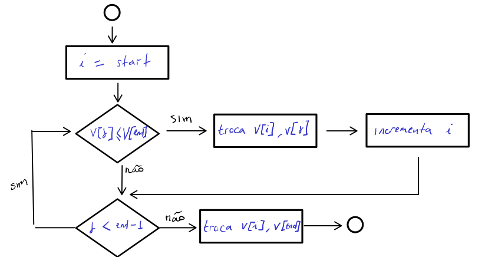
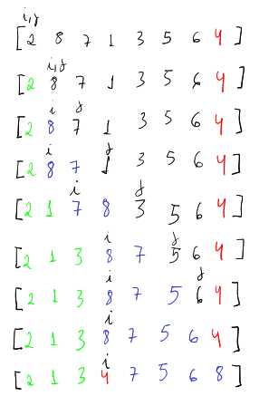

# Introdução
Quicksort é um algoritmo usado para resolver um problema clássico na área da computação chamado de ordenação. O problema de ordenação consiste em ordenar um conjunto de dados de acordo com um critério de ordenação. Por exemplo, ordenar um conjunto de números inteiros de forma crescente ou decrescente.

Existem vários algoritmos de ordenação, cada um com suas vantagens e desvantagens. O algoritmo Quicksort é um dos mais utilizados na prática, pois é um algoritmo eficiente e de fácil implementação. Porém, o algoritmo Quicksort é um dos mais temidos pelos iniciantes em computação, pois é um algoritmo de *difícil entendimento*.

Eu sempre tive dificuldades de entender esse algoritmo, no ínicio de minha jornada eu ficava frustrado por não conseguir compreendê-lo e por isso eu evitava estudá-lo. Porém, com o passar do tempo eu fui aprendendo a importância de entender esse algoritmo e hoje eu o considero um dos meus algoritmos favoritos.

Nesse artigo eu vou desmitificar o algoritmo Quicksort, mostrando que ele não é tão difícil de entender quanto parece. Para isso, eu vou apresentar uma explicação detalhada do algoritmo, passo a passo, e vou ilustrar o código em Python. Além disso, eu vou mostrar a complexidade do algoritmo no pior e melhor caso.


O que você vai aprender com esse artigo:
* A ideia fundamental do algorítmo Quicksort
* O segredo é entender o esquema de particionamento
* Como implementar o algoritmo Quicksort em Python
* Qual a complexidade do algoritmo Quicksort no pior e melhor caso


# Ideia fundamental
O Algoritmo Quicksort utiliza a estratégia de Napoleão Bonaparte de dividir para conquistar. Essa estratégia consiste em dividir um problema em subproblemas menores e mais simples, resolvê-los e depois juntar as soluções dos subproblemas para obter a solução do problema original.

Entretanto, a ideia fundamental do algoritmo é o esquema de particionamento. O esquema de particionamento consiste em dividir um conjunto de dados em partições bem definidas ao redor de um pivô. Todos os elementos a esquerda do pivô devem ser menores que o pivô e todos os elementos a direita do pivô devem ser maiores que o pivô. Considerando um vetor $x$ de $N$ elementos, onde o primeiro elemento é representado pelo índice $p$ e o último elemento é representado por $u$, tal que $x[p p+1 p+2 ... u]$, para qualquer índice k do vetor $x$, a representação matemática para essa propriedade é dada por:

* Se p \<= k \< i, então x[k] \<\= x[u]
* Se i+1 \<= k \< j, então x[k] > x[u]
* Se k = u, então x[k] = x[u]

# O segredo é entender o esquema de particionamento
Existem várias formas para implementar o esquema de particionamento. Porém, a forma mais simples e eficiente é o esquema de particionamento que utiliza o último elemento do vetor como pivô. O esquema de particionamento consiste em percorrer o vetor da esquerda para a direita, comparando cada elemento com o pivô. Se o elemento for menor que o pivô, então ele é trocado com o elemento que está na posição $i$. O índice $i$ é inicializado com o valor $p$. A cada troca, o índice $i$ é incrementado em uma unidade. Ao final do processo, o elemento pivô é trocado com o elemento que está na posição $i$, conforme ilustra o fluxograma da figura abaixo.



A figura abaixo ilustra o esquema de particionamento com um exemplo prático para um vetor de 8 elementos.



Observe que essa rotina divide o vetor de entrada em quatro regiões. A região em verde, são todos os elementos menores que o pivô. A região em azul, são todos os elementos maiores que o pivô. A região em preto, são todos os elementos que ainda não foram processados. A região vermelha é a região do pivô. É importante destacar também a movimentação dos índices $i$ e $j$. O índice $i$ é responsável por marcar o limite entre os elementos menores que o pivô e os elementos maiores que o pivô. O índice $j$ é responsável por percorrer o vetor da esquerda para a direita, comparando cada elemento com o pivô. O índice $i$ incrementa toda vez que o índice $j$ encontra um elemento menor que o pivô.

O esquema de particionamento é a parte mais complicada do algoritmo. Porém, se você conseguir entender essa parte, então você já entendeu 90% do algoritmo. O restante do algoritmo é recursivo e consiste em aplicar o esquema de particionamento em cada subvetor, até que o vetor esteja ordenado.

# A recursividade deixa o algoritmo mais elegante

Recursividade é a capacidade de uma função chamar a si mesma. A recursividade é uma técnica muito utilizada na computação. Ela é muito útil para resolver problemas que podem ser divididos em subproblemas menores e mais simples. A recursividade deixa o algoritmo mais elegante, porém, ela pode deixar o algoritmo mais lento e consumir mais memória. Por isso, é importante analisar a complexidade do algoritmo antes de implementá-lo.

A ideia de recursividade pode ser encontrada no fatorial de um número. Por exemplo, suponha que você queira encontrar o fatorial do número 5. O fatorial de um número é o produto desse número com todos os números naturais menores que ele. O fatorial de 5 é dado por $5! = 5 \times 4 \times 3 \times 2 \times 1$. Ou seja, o fatorial de 5 é equivalente a $5 \times 4!$. O fatorial de 4 é equivalente a $4 \times 3!$. O fatorial de 3 é equivalente a $3 \times 2!$. O fatorial de 2 é equivalente a $2 \times 1!$. O fatorial de 1 é equivalente a $1 \times 0!. O fatorial de 0 é equivalente a 1. 

Dito isto, a primeira vez que a rotina de particionamento é executada, é garantido que todos os elementos a esquerda do pivô são menores que o pivô e todos os elementos a direita do pivô são maiores que o pivô. Porém, os elementos a esquerda e a direita do pivô não estão ordenados. Para ordenar esses elementos, é necessário aplicar o esquema de particionamento em cada subvetor. O esquema de particionamento é aplicado recursivamente até que o vetor esteja ordenado. 

# Hora de colocar a mão na massa
O Código abaixo ilustra a implementação do algoritmo Quicksort em Python. 

```Python
# Quick sort implementation.
from random import shuffle

# initialization
array = list(range(10))
shuffle(array)

# processing
def partition(vector, start, end):
    pivot = vector[end]
    index = start

    for i in range(start, end):
        if vector[i] <= pivot:
            vector[index], vector[i] = vector[i], vector[index]
            index += 1
    
    vector[index], vector[end] = vector[end], vector[index]

    return index

def quick_sort(vector, start, end):
    if start < end:
        index = partition(vector, start, end)
        quick_sort(vector, start, index - 1)
        quick_sort(vector, index + 1, end)
        print(vector)

# termination
print(array)
quick_sort(array, 0, len(array)-1)
```

O algoritmo recebe como entrada um vetor de números inteiros e retorna o vetor ordenado. O algoritmo é implementado em três partes: inicialização, processamento e terminação. Na inicialização, o algoritmo recebe como entrada uma lista de números inteiros armazenada em na variável `array` e embaralha os elementos do vetor usando a função `shuffle`. 

Na parte de processamento, o algoritmo implementa o esquema de particionamento através da função `partition` e aplica o esquema de particionamento recursivamente em cada subvetor dentro da função `quick_sort`. A função `partition` recebe como parâmetro o vetor a ser ordenado, a variável `start` que indica a posição inicial do vetor e a variável `end` que indica sua posição final. Rapare que ele segue fielmente o fluxograma apresentado anteriormente. A função `quick_sort` recebe como parâmetro o vetor a ser ordenado, a variável `start` que indica a posição inicial do vetor e a variável `end` que indica sua posição final. A função `quick_sort` é recursiva e aplica o esquema de particionamento em cada subvetor. O subvetor com elementos menores que o pivô é representado pelos índices `start` e `index - 1`. O subvetor com elementos maiores que o pivô é representado pelos índices `index + 1` e `end`.

Na parte de terminação, o algoritmo imprime o vetor original armazenado na variável `array` e depois chama a função `quick_sort` para ordenar seus elementos. A expressão `len(array) - 1` é usado para calcular o tamanho do vetor de entrada. O vetor ordenado é impresso a cada chamada recursiva da função `quick_sort` para evidenciar a sequência em que os elementos foram ordenados. 

# Qual a complexidade do algoritmo no pior e melhor caso?
O tempo de execução do algoritmo quick sort depende se a rotina de particionamento está ou não balanceada, que por sua vez depende da quantidade de elementos usados em cada particionamento.

O pior caso do algoritmo quicksort ocorre quando a rotina de particionamento divide o vetor de entrada em dois subvetores de tamanho $n-1$ e 0. Nesse caso, o tempo de execução do algoritmo é dado por $T(n) = T(n-1) + \Theta(n)$. A solução dessa recorrência é dada por $T(n) = \Theta(n^2)$.

O melhor caso do algoritmo quicksort ocorre quando a rotina de particionamento divide o vetor de entrada em dois subvetores de tamanho não maior que $n/2$. Nesse caso, o tempo de execução do algoritmo é dado por $T(n) = 2T(n/2) + \Theta(n)$. A solução dessa recorrência é dada por $T(n) = \Theta(n \log n)$.

# Considerações finais
Apesar de ser um algorimto eficiente e de fácil implementação, o algoritmo quicksort é um dos algoritmos mais temidos pelos iniciantes em computação. Entretanto, o segredo para entender o algorimto quicksort é entender a rotina de particionamento. 

O algoritmo quicksort é um algoritmo de ordenação que utiliza a estratégia de dividir para conquistar. Além disso, a ideia fundamental do algoritmo é dividir o vetor de entrada em partições bem definidas ao redor de um pivô, sendo que todos os elementos que antecedem não são maiores que o pivô, bem como os elementos a direita possuem valores maiores que o pivô.

A recursividade deixa o algoritmo mais elegante e funciona como toque de mágica para ordenar os subvetores extraídos a partir do vetor original não ordenado. A complexidade de tempo do algoritmo quicksort é $\Theta(n^2)$ no pior caso e $\Theta(n \log n)$ no melhor caso.

# Referências

Thomas H. Cormen, Charles E. Leiserson, Ronald L. Rivest, Clifford Stein. Introduction to Algorithms. 3rd Edition. The MIT Press. 2009.

[https://www.bigocheatsheet.com/](https://www.bigocheatsheet.com/)

[Quicksort - Canal Programação Dinâmica](https://youtu.be/wx5juM9bbFo)