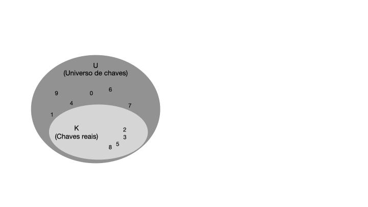
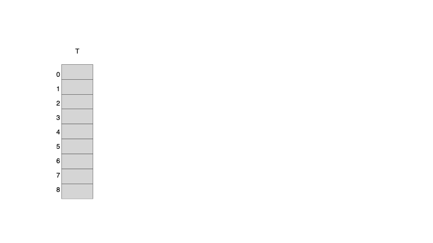

Imagina que você está em um supermercado passando suas compras. João, o caixa que está te atendendo, é novo na empresa e precisa consultar o preço de cada produto em um catálago. Nesse caso, ele irá testar toda sua paciência ao consultar os preços de cada produto no catálago. Enquanto você espera com toda paciência do mundo, e vê a Maria trabalhando no caixa ao lado. Maria já tem anos de experiência como caixa do supermercado, ela decorou todos os preços dos produtos e não precisa consultar o catálago. Maria é como uma tabela hash, ela armazena os preços dos produtos na memória e pode acessá-los rapidamente quando necessário. A tabela hash é uma estrutura de dados eficiente para armazenar e recuperar informações rapidamente, como os preços dos produtos em um supermercado. Se você já tentou e nunca conseguiu entender como a tabela hash funciona, relaxa, O *Engenheiro Moderno* voltou! Neste artigo, vamos explorar as principais aplicações da tabela hash, suas vantagens e desvantagens, e como ela funciona. Vamos lá!

**Sumário do artigo**
1. [Principais aplicações](#principais-aplicações)
2. [Vantagens da tabela hash](#vantagens-da-tabela-hash)
3. [Tabela de enderaçamento direto](#tabela-de-enderaçamento-direto)
4. [Tabela hash](#tabela-hash)
5. [Colisões](#colisões)
6. [Encadeamento](#encadeamento)
7. [Função de hash](#função-de-hash)
8. [Endereçamento aberto](#endereçamento-aberto)
9. [Hashing perfeito](#hashing-perfeito)
10. [Conclusão](#conclusão)
11. [Referências](#referências)

# Principais aplicações
Vamos começar conhecendo as principais aplicações da tabela de espalhamento.

## Dicionários de dados
A tabela hash é uma estrutura eficiente para implementar um dicionário de dados, onde cada elemento é associado a uma chave única. Ela é composta por um vetor de tamanho fixo, onde cada posição é chamada de "slot". Cada slot contém um par chave-valor, onde a chave é usada para calcular o índice do slot usando uma função de hash.
Por exemplo, um caixa de supermercado pode usar uma tabela hash para armazenar o preço de cada produto, onde a chave é o código do produto e o valor é o preço. Quando um cliente compra um produto, o caixa pode pesquisar o preço do produto na tabela hash usando o código do produto como chave. [A linguagem de programação Python](https://engmoderno.com.br/python/), por exemplo, usa uma tabela hash para implementar o tipo de dados "dict", que é uma coleção não ordenada de pares chave-valor. 

## DNS (Domain Name System)
Outro exemplo de aplicação de tabelas hash é o servidor DNS. Um servidor DNS usa uma tabela hash para armazenar os registros de DNS de um domínio, onde a chave é o nome do domínio e o valor é o endereço IP correspondente. Quando um cliente faz uma solicitação de DNS para um domínio, o servidor DNS pesquisa o endereço IP correspondente na tabela hash usando o nome do domínio como chave.

## Cache de dados
Outra aplicação onde a tabela hash é bastante utilizado é em sistemas de cache. Um sistema de cache usa uma tabela hash para armazenar os dados em cache, onde a chave é a URL do recurso e o valor é o conteúdo do recurso. Quando um cliente solicita um recurso, o sistema de cache verifica se o recurso está armazenado em cache usando a URL como chave.

# Vantagens da tabela hash
 A principal vantagem da tabela hash em comparação com outras estruturas de dados é a eficiência na realização de operações de busca, inserção e eliminação de elementos, como dito no início. Como a tabela hash usa uma função de hash para calcular o índice de um elemento em um vetor, o tempo de execução dessas operações é constante, ou seja, O(1). Isso significa que a tabela hash é muito rápida, mesmo para grandes conjuntos de dados.

# Tabela de enderaçamento direto
Para entender o que é uma tabela de espalhamento, vamos começar com um exemplo simples de uma tabela de endereçamento direto. Uma tabela de endereçamento direto é uma estrutura de dados que mapeia chaves para valores usando um vetor de tamanho fixo. Essa técnica funciona bem quando o número de chaves é razoavelmente pequeno e conhecido com antecedência. Considerando um conjunto de chaves **U** com *m* possíveis chaves, a tabela de enderaçamento direto **T** terá o tamanho de *m* posições, na qual cada chave em **U** será mapeada diretamente em um índice correspondente em **T**, conforme ilustra a imagem abaixo.



Observe que o elemento armazenado em cada posição da tabela *T* pode ser um objeto composto por uma chave e dados satélites. A chave é usada para calcular o índice da posição na tabela, enquanto os dados satélites são os dados associados à chave. Por exemplo, se quisermos armazenar o preço de um produto em uma tabela de endereçamento direto, a chave seria o código do produto e os dados satélites seriam o preço do produto.

Por outro lado, se amazernarmos apenas a chave em cada *slot* da tabela, teríamos economia de espaço e uma implementação mais simles.

A desvantagem dessa abordagem é que ela só funciona bem quando o número de chaves é pequeno e conhecido com antecedência. Se o número de chaves for grande ou desconhecido, a tabela de endereçamento direto pode se tornar ineficiente, pois o vetor de tamanho fixo pode ficar muito grande e ocupar muito espaço em memória. Se for preciso armazenar 1.000.000.000 de chaves, por exemplo, e cada chave ocupar 4 bytes, a tabela de endereçamento direto teria que ter 4 GB de memória, o que pode ser inviável em muitos casos. Outro problema é que a quantidader de chaves reais armazenedaas na tabela pode ser muito menor que o tamanho da tabela, o que pode resultar em desperdício de espaço em memória.

# Tabela hash
Uma tabela hash é uma generalização da tabela de endereçamento direto, onde a função de hash é usada para calcular o índice de um elemento em um vetor. A função de hash *h* mapeia uma chave para um índice em um intervalo de 0 a *m-1*, onde *m* é o tamanho de *T*. A função *h* deve ser determinística, ou seja, ela deve sempre retornar o mesmo índice para a mesma chave. A tabela *T* é composta por um vetor de tamanho fixo *|T|=m*, onde cada posição é chamada de "slot". Cada slot contém um par chave-valor, onde a chave é usada para calcular o índice do slot usando a função de hash. A figura abaixo ilustra o funcionamento de uma tabela hash.


Quando o conjunto K de chaves armazenadas em um dicionário é muito menor que o universo **U** de todas as chaves possíveis, uma tabela de espalhamento requer armazenamento muito menor que uma tabela de endereços diretos. Note que, |U| >> |T|, e a função *h* mapeia as chaves de **U** para os índices de *T*. A função de hash deve ser eficiente e distribuir as chaves de forma uniforme em *T* para evitar colisões, que ocorrem quando duas chaves são mapeadas para o mesmo índice.

# Colisões
Se dois elementos forem mapeados para uma mesma chave em *T*, é dito que houve uma *colisão*, que deve ser resolvida usando uma técnica de resolução de colisões, como encadeamento ou endereçamento aberto. No exemplo acima, as chaves k5 e k2 foram mapeadas para o mesmo índice correspondente a *h(k5)=h(k2)*, resultando em uma colisão.
A resolução de colisões é um dos principais desafios ao implementar uma tabela hash eficiente, pois pode afetar o desempenho da tabela hash. 

# Encadeamento
O encadeamento é uma técnica de resolução de colisões que consiste em armazenar todos os elementos que colidem em uma lista encadeada. Cada slot em *T* contém uma lista encadeada de elementos, onde cada elemento é um irá a chave correspondente que seria armazenada na posição da tabela calculado pela função *h*. Quando ocorre uma colisão, o novo elemento é adicionado à lista encadeada correspondente. A figura abaixo ilustra o funcionamento do encadeamento. Essa é a maneira mais comum de resolver colisões em tabelas hash. 

A figura abaixo ilustra o funcionamento do encadeamento. Note as listas encadeadas geradas pelas colisões dos elementos. 


O tempo de execução da operação de inserção em uma tabela de espalhamento que utiliza resolução de colisões por encadeamento é na ordem O(1), considerando que a inserção ocorre sempre no início da lista. O tempo de execução da ooeração de eliminação também é na ordem O(1), considerando uma implementação de lista duplamente encadeada e recebendo o ponteiro do elemento a ser eliminado. Entretanto, o tempo de execução da operação de busca é na média theta(1 + alpha), onde alpha é o fator de carga da tabela, que é a razão entre o número de elementos armazenados e o tamanho da tabela. Se a função de hash distribuir as chaves de forma uniforme, o fator de carga será baixo e o tempo de execução da operação de busca será constante. Existe uma matématica para demonstrar o tempo de execução da operação de busca que pode ser encontrada em [Algoritmos: Teoria e Prática](https://amzn.to/3VrjTBJ).

Uma pergunta que você deve estar se fazendo é: Como calcular a função de hash? Calma, calabreso! Essa pergunta será respondida na próxima seção.

# Função de hash
Uma boa função hash satisfaz (aproximadamente) a premissa do hashing uniforme simples, isto é, cada chave tem igual probabilidade de passar para qualquer das m posições por uma operação de hash.
Além disso, Uma boa função hash minimiza a chance de pequenas variações nos símbolos passarem para a mesma posição após o hashing. Uma boa abordagem deriva o valor hash de um modo que esperamos seja independente de quaisquer padrões que possam existir nos dados. Existem três tipos de esquemas para criação de boas funções hash: por divisão, por multiplicação e por hash universal.

## Função de hash por divisão
A função de hash por divisão é a mais simples de implementar. Ela consiste em dividir a chave pelo tamanho da tabela e usar o resto da divisão como índice. A fórmula para a função de hash por divisão é a seguinte:

```
h(k) = k mod m
```

Onde *k* é a chave e *m* é o tamanho da tabela. A função de hash por divisão é eficiente e fácil de implementar, mas pode resultar em colisões se o tamanho da tabela não for um número primo. Para evitar colisões, é recomendável que o tamanho da tabela seja um número primo.

## Função de hash por multiplicação
A função de hash por multiplicação é uma técnica mais sofisticada que usa a multiplicação de ponto flutuante para calcular o índice da tabela. A fórmula para a função de hash por multiplicação é a seguinte:

```
h(k) = floor(m * (k * A mod 1))
```
Onde *k* é a chave, *m* é o tamanho da tabela e *A* é uma constante entre 0 e 1. A constante *A* deve ser escolhida de forma que *A * 2^w* seja próximo de um número inteiro, onde *w* é o número de bits da palavra da máquina. O método da multiplicação extrai *p* bits de mais alta ordem da metade inferior do produto *k * s*, onde *s = A * 2ˆw*. A função de hash por multiplicação é mais eficiente que a função de hash por divisão, pois distribui as chaves de forma mais uniforme na tabela. No entanto, ela é mais complexa de implementar e requer mais recursos computacionais.

## Função de hash universal
Dado uma coleção finita de funções de hash *H*, dizemos que *H* é universal se, para cada par de chaves distintas *k* e *l*, a probabilidade de *h(k) = h(l)* é no máximo 1/*m*, onde *m* é o tamanho da tabela. Em outras palavras, uma função de hash é universal se ela distribui as chaves de forma uniforme na tabela e minimiza as colisões. A formula da função hash universal é a seguinte:

```
h(k) = ((a * k + b) mod p) mod m
```

Onde *a* é qualquer número que pertence ao conjunto *Z'p* e *b* ao conjunto *Zp* , *p* é um número primo maior que o tamanho da tabela e *m* é o tamanho da tabela, logo, *0 < k < p-1*. Vale destacar que *Z* representa o conjunto formado pelos inteiros naturais, sendo *Z'p = [1, 2, ..., p-1]* e *Zp = [0, 1, ..., p-1]*.

# Endereçamento aberto
Outra forma de resolver o problema da colisão de chaves é o enderaçamento aberto. Nesse caso, todos os elementos são armazenados diretamente na tabela, sem a necessidade de listas encadeadas. Quando ocorre uma colisão, a tabela hash é percorrida em busca de um slot vazio, onde o novo elemento pode ser inserido. Existem várias técnicas de endereçamento aberto para resolver colisões, como sondagem linear, sondagem quadrática e hashing duplo.

O algoritmos de inserção na tabela de espalhamento que utiliza enderaçamento aberto é dados a seguir:

```js
Inserir(T, k)
    i = 0
    while i < m
        j = h(k, i)
        if T[j] == NIL or T[j] == DELETED
            T[j] = k
            return j
        else
            i = i + 1
    return "tabela cheia"
```

O algoritmo de busca é semelhante ao de inserção, mas retorna o índice do elemento encontrado ou "não encontrado" se o elemento não estiver na tabela.

```js
Buscar(T, k)
    i = 0
    while i < m
        j = h(k, i)
        if T[j] == k
            return j
        else if T[j] == NIL
            return "não encontrado"
        else
            i = i + 1
    return "não encontrado"
```

O algoritmo de eliminação é semelhante ao de busca, mas marca o slot como DELETED em vez de NIL.

```js
Eliminar(T, k)
    i = 0
    while i < m
        j = h(k, i)
        if T[j] == k
            T[j] = DELETED
            return j
        else if T[j] == NIL
            return "não encontrado"
        else
            i = i + 1
    return "não encontrado"
```
## Sondagem linear
A sondagem linear é uma técnica de endereçamento aberto que consiste em percorrer a tabela hash em incrementos fixos até encontrar um slot vazio. A fórmula para a sondagem linear é a seguinte:

```
h(k, i) = (h'(k) + i) mod m
```

Onde *h'(k)* é a função de hash original e *i* é o incremento. A sondagem linear é eficiente e fácil de implementar, mas pode sofrer com o probelam de agrupamento primário de chaves, o que pode afetar o desempenho da tabela hash. O agrupamento primário de chaves ocorre quando há longas sequencias de slots ocupados, o que pode resultar em colisões adicionais. A figura abaixo ilustra o funcionamento da sondagem linear.


## Sondagem quadrática

A sondagem quadrática é uma técnica de endereçamento aberto que consiste em percorrer a tabela hash em incrementos quadráticos até encontrar um slot vazio. A fórmula para a sondagem quadrática é a seguinte:

```
h(k, i) = (h'(k) + c1 * i + c2 * i^2) mod m
```

Onde *h'(k)* é a função de hash original, *c1* e *c2* são constantes e *i* é o incremento. A sondagem quadrática é mais eficiente que a sondagem linear, pois distribui as chaves de forma mais uniforme na tabela. No entanto, ela pode sofrer com o problema de agrupamento secundário de chaves, o que pode afetar o desempenho da tabela hash. O agrupamento secundário de chaves ocorre quando há longas sequencias de slots, porém mais branda que o agrupamento primário. A figura abaixo ilustra o funcionamento da sondagem quadrática.


## Hashing duplo

O hashing duplo é uma técnica de endereçamento aberto que consiste em usar duas funções de hash para calcular o índice da tabela. A fórmula para o hashing duplo é a seguinte:

```
h(k, i) = (h1(k) + i * h2(k)) mod m
```

Onde *h1(k)* e *h2(k)* são funções de hash diferentes e *i* é o incremento. O hashing duplo é mais eficiente que a sondagem linear e quadrática, pois distribui as chaves de forma mais uniforme na tabela. No entanto, ele é mais complexo de implementar e requer mais recursos computacionais. A figura abaixo ilustra o funcionamento do hashing duplo.


# Hashing perfeito
Caso você precise garantir que o tempo de execução no pior caso para a tabela de espalhamento seja na ordem O(1), você pode utilizar o hashing perfeito. O hashing perfeito é garantido se o conjunto de chaves é **estático**, ou seja, uma vez armazenado na tabela, o conjunto de chaves nunca muda. O Hash perfeito utiliza dois níveis de hash universal para garantir que não haja colisões na tabela hash. O primeiro nível é igual ao hash por encadeamento: cada chave é mapeada para um slot usando a função hash universal *hi*. Entretanto, ao invés de utilizar uma lista ligada para resolver colisões, uma pequena tabela hash é utilizada para armazenar os elementos que colidiram no primeiro nível. A função de hash *hj* para a segunda tabela é escolhida de forma que não haja colisões entre os elementos usando hash universal. Para garantir que não haja colisões no segundo nível de hash, o tamanho *mj* da tabela *Tj* é quadrado do número de chaves em *Tj*. A figura abaixo ilustra o funcionamento do hashing perfeito. Apesar da dependência quadrática de armazenamento na tabela secundária *Tj*, a quantidade total de espaço necessário para implementar o hashing perfeito é linear no número de chaves armazenadas, ou seja, é na ordem O(n). A figura a seguir ilustra o funcionamento do hashing perfeito.




# Conclusão

A tabela hash é uma estrutura de dados eficiente para implementar operações de busca, inserção e eliminação de elementos com tempo de execução na ordem O(1). Ela usa uma função de hash para calcular o índice de um elemento em um vetor, o que permite acesso rápido aos elementos. Existem várias técnicas para resolver colisões em tabelas hash, como encadeamento e endereçamento aberto. Cada técnica tem suas vantagens e desvantagens, e a escolha da técnica certa depende do problema que está sendo resolvido. Espero que este artigo tenha ajudado a entender melhor o conceito de tabela hash e como ela funciona. Qualquer dúvida ou sugestão, deixe um comentário. 

# Referências
Abaixo estão algumas referências para quem deseja se aprofundar no assunto. Adiquirindo os livros através desses links você estará ajudando a manter o blog. Obrigado!

[Entendendo Algoritmos](https://amzn.to/4eq3oyG)

[Estruturas de Dados e Algoritmos com JavaScript: Escreva um Código JavaScript Complexo e Eficaz Usando a Mais Recente ECMAScript](https://amzn.to/4et0LMA)

[Introduction to Algorithms](https://amzn.to/45KzkKl)

[Algoritmos: Teoria e Prática](https://amzn.to/3VrjTBJ)