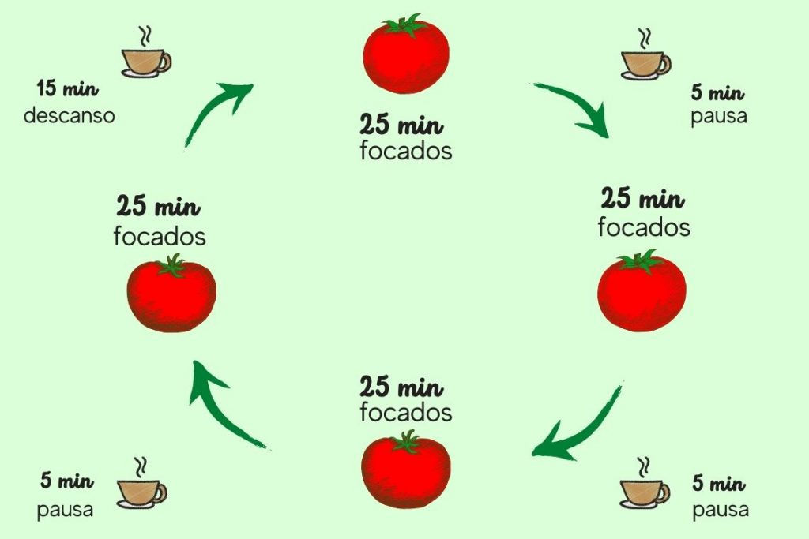
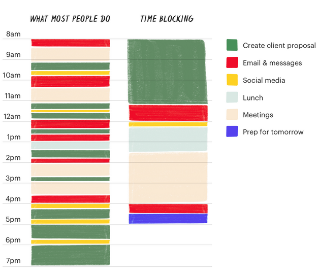
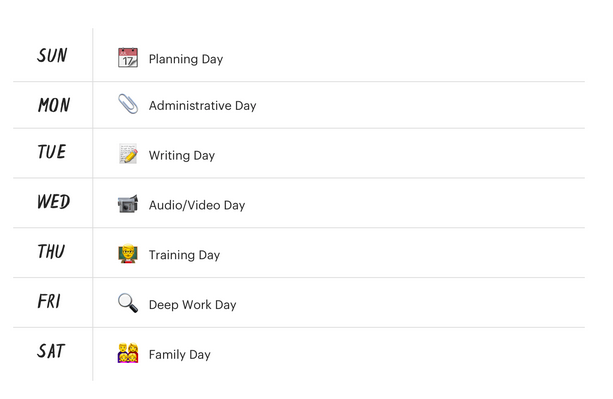
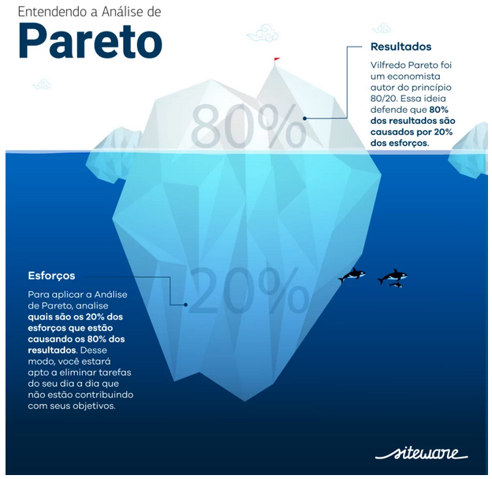
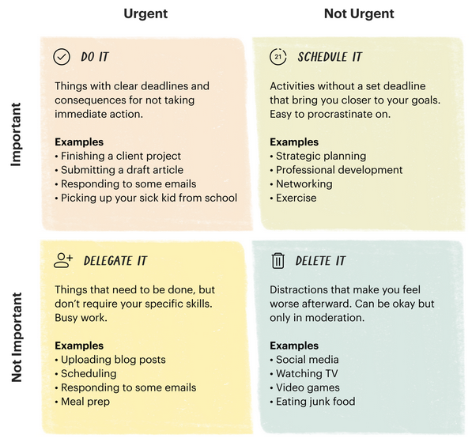

Você se considera uma pessoa procrastinadora? Procrastinação é o ato de deixar
uma tarefa ou atividade para depois. Quando esse ato se torna crónico, pode causar
stress, sensação de culpa, vergonha, culpa por não cumprir com suas responsabilidades, e, principalmente,
baixa produtividade.

Estudos indicam que a procrastinação é um fenômeno motivacional, apresentando elementos 
individuais e contextuai. De acordo com Potts (1987), esse fenômeno ocorre em ao menos 95% da população 
em geral e, cronicamente​ entre 15% a 20% de adultos e 33% a 50% de estudantes.​

Isso quer dizer que a maioria das pessoas no mundo em um determinado momento,
inevitavelmente já procrastinou ou vai procrastinar uma tarefa. Isso é absolutamente normal.
O que não é normal é deixar que a procrastinação prejudique sua produtividade no trablho ou na escola.

Por isso, resolvi fazer esse post para te ajudar a dimunir a procastinação através
de 7 técnicas para melhorar a produtividade que pode ser aplicada no nosso trabalho, nos estudos,
ou em alguma outra atividade que você exerça.

Ao pesquisar algumas dessas técnias, não encontrei uma tradução equivalente para o português, por isso
elas vão continuar com o respectivo nome em inglês.

# Técnica de pomodoro
A Técnica Pomodoro foi desenvolvida no final dos anos 1980 pelo então 
estudante universitário Francesco Cirillo. Cirillo estava lutando para 
se concentrar em seus estudos e concluir as tarefas. 

Sentindo-se sobrecarregado, ele se comprometeu a apenas 10 minutos de tempo 
de estudo concentrado. Incentivado pelo desafio, encontrou um timer de 
cozinha em formato de tomate (pomodoro em italiano) e assim nasceu a 
técnica Pomodoro.​

*A técnica pomodoro consiste de períodos de 25 minutos (chamados “pomodoros”) 
que deverão ser usados na realização das suas tarefas sem que haja nenhuma interrupção. 
durante a jornada.*

Experimente a Técnica Pomodoro se você...

* Tem várias pequenas distrações que atrapalham todo o dia de trabalho
* Não consegue ter um ponto de produtividade ideal
* Possui muitos trabalhos em aberto que podem consumir um tempo ilimitado (por exemplo, estudar para um exame, pesquisar para um post de blog, etc.)
* É excessivamente otimistas quando se trata de quanto você pode fazer em um dia.
* Curte metas gamificadas

# Getting Things Done (GTD)
Getting Things Done, ou GTD para abreviar, é um sistema
popular de gerenciamento de tarefas criado pelo consultor de
produtividade David Allen. 

A metodologia é baseada em uma verdade simples: quanto mais informações circulando em sua
cabeça, mais difícil é decidir o que precisa de atenção. Como
resultado, você gasta mais tempo pensando em suas tarefas
do que realmente fazendo-as. Quando as informações se
acumulam em sua cabeça, isso leva ao estresse, à opressão e à incerteza.

A técnica GTD é indicada para pessoas que estão sobrecarregados com a quantidade de coisas que precisam acompanhar,
sempre esquecem pequenos detalhes ou iniciam muitos projetos, mas tem dificuldade em finalizá-los.

Em resumo, o método GTD é composto por cinco práticas simples para sistematizar a caos em seu cérebro e fazer as coisas acontercerem:

* **Capturar**: capture tudo o que passar pela sua cabeça. Nada é muito grande ou pequeno! Esses itens vão diretamente para sua caixa de entrada;
* **Esclarecer**: processe o que você capturou em etapas de ação claras e concretas. Decida se um item é um projeto, próxima ação ou referência;
* **Organizar**: Coloque tudo no lugar certo. Adicione datas ao seu calendário, delegue projetos a outras pessoas, arquive o material de referência e organize suas tarefas;
* **Revisar**: Examine, atualize e revise suas listas com frequência;
* **Mexa-se**: comece a trabalhar nas coisas importantes.

# Bloqueio de tempo
Uma semana de trabalho de 40 horas com bloqueio de tempo, 
produz a mesma quantidade de produção que
uma semana de trabalho de mais de 60 horas seguidas
sem estrutura segundo Cal Newport, autor de Deep Work.

A técnica de bloqueio de tempo consiste em dividir o dia em blocos, cada um
dedicado a realizar uma tarefa ou atividade específica e apenas isso.
Algumas possíveis variações são tarefas em lote, tema
do dia e intervalo de tempo.

Essa técnica é ideal para pessoas que estão envolvidas em muitos projetos,
passam muito tempo respondendo emails e mensagens mas possui outras responsabilidades,
dividem seus dias em várias reuniões, sofrem interrupções constantes ao longo do dia.

A figura a seguir compara uma agenda sem e com a utilização da técnica do bloqueio de tempo.
Na coluna da esquerda, é a agenda da maioria das pessoas que não utiliza a técnica.
Note como as atividades estão desorganizados, dificilmente conseguirá produzir um bom resultado.
Por outro lado, na coluna da esquerda está a agenda de uma pessoa que utiliza a técnica
de bloqueio de tempo. É visível como as atividades ficam organizadas e a probabilidade
de concluir uma tarefa aumenta.

*Extraído de [https://todoist.com/productivity-methods/time-blocking](https://todoist.com/productivity-methods/time-blocking)*

O bloqueio de tempo é bem parecido com a técnica de tarefas em lotes. Tarefas em lote é quando você agrupa tarefas semelhantes 
(geralmente menores) e agenda blocos de tempo específicos para serem 
concluídos de uma só vez. Ao lidar com tarefas semelhantes em lotes, 
você limitará a quantidade de troca de contexto que precisa fazer ao 
longo do dia, economizando um tempo precioso e energia mental. 
Por exemplo, agendar dois blocos de 20 minutos para processar e-mail 
durante o dia é mais eficiente do que verificar sua caixa de entrada a 
cada 15 minutos.

Outra técnica parecida com bloqueio de tempo é a tema do dia.
O tema do dia é uma versão mais extrema do tarefas em lotes para pessoas 
que têm muitas áreas de responsabilidade competindo por sua atenção. 
Por exemplo, um empreendedor geralmente precisa prestar atenção ao marketing, 
vendas, desenvolvimento de produtos, suporte ao cliente e RH, tudo ao mesmo 
tempo. Em vez de reservar blocos de tempo para cada área de responsabilidade 
a cada dia, o tema do dia dedica um dia inteiro a cada responsabilidade, 
conforme ilustra a figura a seguir.

*Extraído de [https://todoist.com/productivity-methods/time-blocking](https://todoist.com/productivity-methods/time-blocking)*

Outra técnia relacionada é o intervalo de tempo. 
Bloqueio de tempo e intervalo de tempo são muitas vezes confundidos como sinônimos, 
mas há uma diferença importante. O bloqueio de tempo pede que você reserve certos 
períodos de tempo para se concentrar em uma determinada tarefa ou atividade. 
Por exemplo, "Vou trabalhar em um primeiro rascunho da postagem do meu blog das 9h às 11h de amanhã".

Em contraste, o intervalo de tempo pede que você imponha um limite de quanto tempo 
você dedicará a uma tarefa específica. Aqui está uma versão em intervalo de tempo 
do exemplo de bloqueio de tempo acima: "Vou terminar um primeiro rascunho da minha postagem no blog amanhã entre 9h e 11h."

Esse intervalo de tempo auto-imposto o força a trabalhar com eficiência 
porque você tem um tempo limitado para concluir a tarefa. 
Pode ser uma maneira divertida de desafiar a si mesmo e gamificar sua produtividade.

Vale destacar que você pode combinar as técnias de gerenciamento de tempo conforme sua necessidade.

# Análise de Pareto
Também conhecida como Regra 80/20, Curva ABC ou, ainda, Diagrama de Pareto, 
a Análise de Pareto é um esquema, geralmente em forma de gráfico de colunas, 
que agrupa e ordena a frequência de determinadas ocorrências. 
Tudo é feito com base em uma ideia bem simples: de que 80% das
consequências advêm de 20% das causas. A imagem a seguir ilustra essa ideia.

*Extraído de [https://www.siteware.com.br/metodologias/analise-de-pareto/](https://www.siteware.com.br/metodologias/analise-de-pareto/)*

O nome é uma homenagem ao economista italiano Vilfredo Pareto. 
Ele identificou que uma concentração de 80% da economia permanecia em 
poder de apenas 20% da população. E isso era o que gerava os principais 
problemas econômicos do país.

O objetivo desse método é demonstrar que as pessoas podem usar seu tempo 
e energia em questões realmente graves pois é comum nos preocuparmos em problemas sem importância.

Essa realidade também pode ser observada no nosso trabalho. Em vez de gastar horas com 
atividades repetitivas é possível se focar em ações específicas, 
e mais estratégicas, que irão gerar a maioria dos resultados.

# Eat the frog
Geralmente as pessoas superestimam o que conseguem realizar em um dia,
porém subestimam o que podem realizar em um ano. O principal objetivo da técnica
comer um sapo é contornar a armadilha mental diante de um dia cheio de tarefas.

Essa técnica é indicada para aquelas pessoas que lutam contra a procrastinação,
fazem muita coisa, mas não está progredindo nas coisas importantes, 
tem dificuldade em aderir a um sistema de produtividade, possuem problemas para decidir no que trabalhar a qualquer momento,
e se sentem sobrecarregado com sua lista de tarefas.

O Algoritmo para executar essa técnica consiste basicamente em três passos:

1. *Identifique seu sapo*: também conhecida como tarefa mais difício, ou a atividade mais importante do dia. Apenas uma!
2. *Coma*: faça a atividade mais importante logo pela manhã. Não dê a chance de adiar.
3. *Repita*: Repita a cada a dia. Você irá perceber que de grão em grão você conseguirá construir um castelo.

# Matriz de Eisenhower
Essa ferramenta de priorização de tarefas ajuda você a combater o efeito da “mera
urgência”, eliminar os desperdícios de tempo em sua vida e criar mais espaço mental para
progredir em seus objetivos. Ela foi baseada nas conquistas e ensinamentos do general cinco estrelas
e presidente dos Estados Unidos, Dwight D. Eisenhower. 

A matrix de Eisenhower é indicada para quem vive apagando incêndios o dia todo (metaforicamente),
está ocupado mas não sente que seu trabalho tem um grande impacto,
tem objetivos de longo prazo, mas não tem tempo ou energia para progredir neles,
ou possui dificuldade em delegar e/ou dizer não.

Essa matriz é composta de por duas colunas (urgente e não urgente) 
e duas linhas (importante e não importante) formando quatro quadrantes conforme ilustra a figura a seguir. 
Isso ajuda a visualizar todas as suas tarefas e categorizá-las de acordo com esses quadrantes.

*Extraído de [https://todoist.com/productivity-methods/eisenhower-matrix](https://todoist.com/productivity-methods/eisenhower-matrix)*

É importante destacar que:

* Tarefas urgentes e importantes a serem concluídos imediatamente
* Tarefas não urgentes e importantes a serem agendados em seu calendário
* Tarefas urgentes e sem importância a serem delegados a outra pessoa
* Tarefas não urgentes e sem importância a serem excluídos

# Pato de borracha

Por último, mas não menos importante a técnia do pato de borracha pode ajudar você
a encontrar a solução daquele problema que está travando o projeto. Essa é uma técnica
bastante utilizada por programadores esperientes para depurar seu código a fim de que possam encontrar algum erro,
mas também pode facilmente ser aplicada em outras áreas de atuação.

A técnica consiste de quatro etapas:
* Implore, peça emprestado, roube, compre, fabrique ou obtenha de outra forma um pato de borracha.
* Coloque o pato de borracha na mesa e informe que você apenas revisará algum problema com ele, se estiver tudo bem.
* Explique ao pato o que seu problema de maneira geral, em seguida, explique seu problema detalhadamente.
* Em algum momento, você dirá ao pato o que está fazendo a seguir e então perceberá que isso não é de fato o que você está fazendo. O pato ficará ali sentado serenamente, feliz por saber que o ajudou em seu caminho.

# Considerações finais

> Comece onde você está, use o que você tem e faça o que você pode (Richard Branson).

Essas foram as 7 técnicas para melhorar sua produtividade. Vale ressaltar que você pode usar mais de uma no seu dia a dia
e fazer as adaptações necessárias conforme sua necessidade. Espero que tenha gostado e se ficou alguma dúvida é só deixar seu comentário.

# Referencias

[Pomodoro](https://todoist.com/productivity-methods/pomodoro-technique)

[Getting Things Done](https://todoist.com/productivity-methods/getting-things-done)

[Bloqueio de tempo](https://todoist.com/productivity-methods/time-blocking)

[Análise de Pareto](https://www.siteware.com.br/metodologias/analise-de-pareto/)

[Eat the frog](https://todoist.com/productivity-methods/eat-the-frog)

[Matriz de Eisenhower](https://todoist.com/productivity-methods/eisenhower-matrix)

[Pato de borracha](https://rubberduckdebugging.com/)

